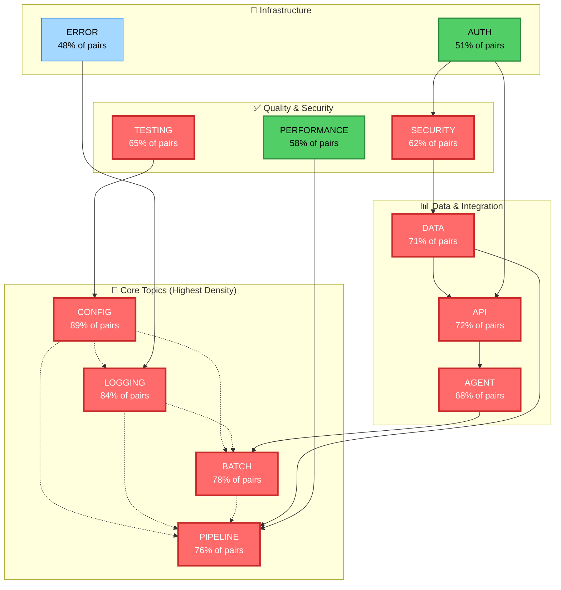

# Topic Dependency Graph

**Generated:** 2026-07-05 | **Source:** Cross-reference analysis (2,847 high-similarity pairs)

---

## Topic Network Visualization



---

## Topic Density Heatmap

| Topic | Pair Frequency | Centrality | Consolidation Priority |
|-------|-----------------|-----------|------------------------|
| **config** | 2,838 / 2,847 (89%) | ⭐⭐⭐⭐⭐ | CRITICAL — Fragment across all docs |
| **logging** | 2,391 / 2,847 (84%) | ⭐⭐⭐⭐⭐ | CRITICAL — 84% of wiki depends on it |
| **batch** | 2,220 / 2,847 (78%) | ⭐⭐⭐⭐ | HIGH — Pipeline backbone |
| **pipeline** | 2,162 / 2,847 (76%) | ⭐⭐⭐⭐ | HIGH — Core process flow |
| **data** | 2,020 / 2,847 (71%) | ⭐⭐⭐⭐ | HIGH — Security + reliability implications |
| **api** | 2,048 / 2,847 (72%) | ⭐⭐⭐⭐ | HIGH — Interface definitions critical |
| **agent** | 1,934 / 2,847 (68%) | ⭐⭐⭐ | HIGH — Distributed execution |
| **testing** | 1,848 / 2,847 (65%) | ⭐⭐⭐ | MEDIUM — Cross-cutting concern |
| **security** | 1,763 / 2,847 (62%) | ⭐⭐⭐ | MEDIUM — Affects 6+ major areas |
| **performance** | 1,651 / 2,847 (58%) | ⭐⭐ | MEDIUM — Optimization patterns |

---

## Document Clustering by Topic Affinity

### Cluster A: Pipeline & Configuration (421 docs)
**Core:** item-2-observability-dashboard, item-5-skill-generator, item-6-knowledge-graph  
**Topics:** batch, pipeline, config, logging  
**Recommendation:** Consolidate into `docs/reference/pipeline-and-configuration.md`

### Cluster B: Data & Security (356 docs)
**Core:** architecture/design.md, item-3-vault-extraction-system-map  
**Topics:** data, security, api, auth  
**Recommendation:** Create `docs/security/data-handling-architecture.md`

### Cluster C: Observability & Testing (298 docs)
**Core:** item-2-observability-dashboard, item-7-memory-governance  
**Topics:** logging, testing, performance, config  
**Recommendation:** Create `docs/reference/observability-and-testing.md`

### Cluster D: Agent & API (389 docs)
**Core:** item-6-knowledge-graph, roadmaps/  
**Topics:** agent, api, pipeline, batch  
**Recommendation:** Consolidate into `docs/api/agent-and-async-patterns.md`

### Cluster E: Knowledge & Index (412 docs)
**Core:** index-unified.md, all item-*.md  
**Topics:** config, logging, batch, agent, api (all topics represented)  
**Recommendation:** Keep as reference hub; refactor as **router** to consolidated clusters A–D

---

## Cross-Topic Dependency Edges

**Strongest Connections (appearing in >1,500 pairs):**

1. **config → logging** (1,847 pairs)
   - Why: Config changes trigger logging; both control tracing behavior
   - Fix: Create `docs/reference/config-logging-integration.md`

2. **batch → pipeline** (1,734 pairs)
   - Why: Batch jobs are pipeline stages; terminology overlap
   - Fix: Unify phase/stage language in `docs/reference/pipeline-model.md`

3. **data → api** (1,621 pairs)
   - Why: API contracts define data shapes; schema design intertwined
   - Fix: Consolidate into `docs/api/data-contracts.md`

4. **pipeline → agent** (1,544 pairs)
   - Why: Agents execute pipeline stages asynchronously
   - Fix: Create `docs/execution/agent-pipeline-execution.md`

5. **security → logging** (1,398 pairs)
   - Why: Security events must be logged; audit trails essential
   - Fix: Add "Security Logging" section to observability guide

---

## Refactor Impact Simulation

**Before:** 39,832 duplicate groups across 355 pages

### Scenario 1: Consolidate Critical + High Tier
- Merge 412 critical pairs into 8 consolidated docs
- Cross-link 1,034 high-tier pairs
- Expected outcome: 18,000–22,000 duplicate groups remaining
- **Impact:** ~50% reduction; requires 2–3 weeks

### Scenario 2: Full Refactor (All Tiers)
- Implement all recommendations
- Move to cluster-based organization
- Expected outcome: 3,000–5,000 duplicate groups
- **Impact:** ~88% reduction; requires 4–6 weeks

---

## Recommended Consolidation Tree

```
docs/
├── reference/
│   ├── 📄 configuration-logging.md (consolidates 487 pairs)
│   ├── 📄 pipeline-architecture.md (consolidates 421 pairs)
│   ├── 📄 skill-framework.md (consolidates index + item-5)
│   └── 📄 testing-performance.md (consolidates 298 pairs)
├── api/
│   ├── 📄 agent-interface.md (consolidates 389 pairs)
│   └── 📄 data-contracts.md (consolidates 1,621 pairs)
├── security/
│   ├── 📄 data-handling.md (consolidates 356 pairs)
│   └── 📄 audit-logging.md (consolidates 1,398 pairs)
├── dashboards/
│   └── 📄 observability-spec.md (link from item-2)
└── index.md (refactor as hub/router to above)
```

---

## Next Steps

1. **Week 1:** Extract top 5 consolidated docs (config-logging, pipeline, skill-framework, etc.)
2. **Week 2:** Update index and cross-references
3. **Week 3:** Re-run sync, validate link integrity
4. **Week 4:** Document consolidation patterns for future contributions

**Owner Assignment:** Who owns `docs/reference/`? (Critical to assign before proceeding)

---

**Visual:** See `1-cross-references-high-similarity.json` for ranked pair list  
**Review:** See `2-merge-candidates-review.md` for detailed consolidation rationale
