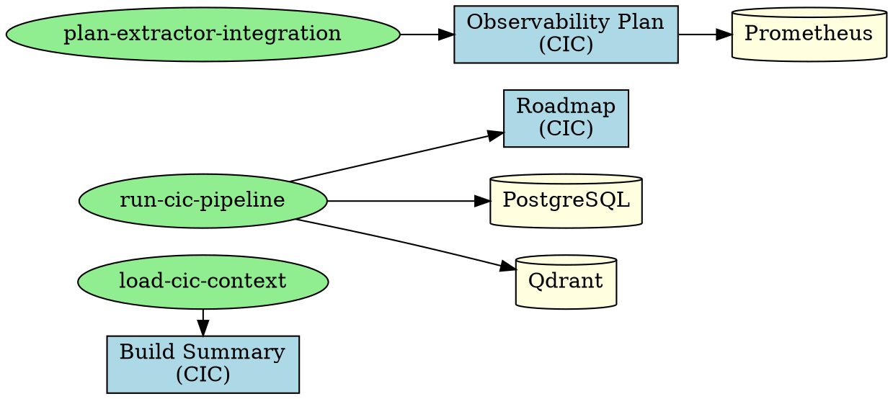

# ITEM 3: VAULT EXTRACTION & SYSTEM MAP
**Date:** 2026-07-02  
**Purpose:** Extract vault backlinks → queryable system dependency map  
**Status:** Ready to implement

---

## OBJECTIVE

Transform Obsidian vault backlinks (from C:\dev\.obsidian\graph.json and wikilink syntax) into a queryable directed graph that shows:
- **Architecture dependencies** (CIC → RL, layer order)
- **Skill → reference mappings** (which skill reads which vault docs)
- **Operational state** (what's built, in progress, unbuilt)
- **Cross-project impacts** (if RL changes, what CIC docs need update)

---

## VAULT STRUCTURE (Current)

```
C:\dev\
├── .obsidian/          ← Graph metadata
├── cic-ref/            ← CIC stable architecture (7 docs)
│   ├── BUILD-SUMMARY.md
│   ├── AGENTS.md
│   ├── AGENTS_API.md
│   ├── CIC_ENV_REFERENCE.md
│   ├── CIC_RUNTIME_OBSERVABILITY_PLAN.md
│   ├── CIC_TOKEN_PACK_v2_0_FULL_LIST.md
│   └── ROADMAP.md
├── rl-ref/             ← RL stable architecture (pending)
├── architecture/       ← Shared patterns
├── 00-INDEX.md         ← Master index (wikilinks to all docs)
└── 00-EXECUTIVE-SUMMARY.md
```

---

## DATA EXTRACTION STRATEGY

### Step 1: Parse Wikilinks from Markdown

**From:** `[[cic-ref/BUILD-SUMMARY|System Overview]]`  
**Extract:** `source=00-INDEX.md`, `target=cic-ref/BUILD-SUMMARY.md`, `label=System Overview`

Tool: Regex `\[\[([^\]|]+)(?:\|([^\]]+))?\]\]`

### Step 2: Build Dependency Graph

**Node types:**
- `doc` — Markdown file (BUILD-SUMMARY.md)
- `skill` — Operator tool (load-cic-context, run-cic-pipeline)
- `system` — External system (PostgreSQL, Prometheus, Qdrant)

**Edge types:**
- `references` — Doc links to doc
- `implements` — Skill reads doc
- `depends_on` — Component needs system

### Step 3: Enrich with Metadata

**Per document:**
- Phase (sync date, last update)
- Status (✓ Operational, ⚙ In Progress, ✗ Unbuilt)
- Owner (CIC vs RL)
- Touched by (which skills)

**Per skill:**
- Purpose (research, integration, pipeline)
- Inputs (which docs it reads)
- Outputs (what it produces)

---

## SYSTEM MAP DATA MODEL

```json
{
  "metadata": {
    "generated": "2026-07-02T16:30:00Z",
    "vault_root": "C:\\dev",
    "graph_format": "dot",
    "node_count": 24,
    "edge_count": 67,
    "last_vault_sync": "2026-07-02T10:42:39Z"
  },
  "nodes": [
    {
      "id": "cic-ref/BUILD-SUMMARY",
      "type": "doc",
      "label": "CIC Build Summary",
      "path": "cic-ref/BUILD-SUMMARY.md",
      "status": "operational",
      "owner": "CIC",
      "phase": "production",
      "last_modified": "2026-06-24",
      "key_sections": ["Architecture Layers", "Deployment", "Testing Coverage"],
      "references": ["cic-ref/ROADMAP", "cic-ref/CIC_RUNTIME_OBSERVABILITY_PLAN"],
      "referenced_by": ["00-INDEX", "load-cic-context"],
      "tags": ["architecture", "production-ready"]
    },
    {
      "id": "load-cic-context",
      "type": "skill",
      "label": "Load CIC Context",
      "status": "active",
      "version": "2.1.0",
      "reads": ["cic-ref/BUILD-SUMMARY", "cic-ref/CIC_ENV_REFERENCE"],
      "emits": ["CIC_CONTEXT block"],
      "purpose": "Hydrate operator context before pipeline work",
      "depends_on": ["vault-sync"]
    }
  ],
  "edges": [
    {
      "source": "00-INDEX",
      "target": "cic-ref/BUILD-SUMMARY",
      "type": "references",
      "label": "System Overview",
      "context": "navigation"
    },
    {
      "source": "load-cic-context",
      "target": "cic-ref/BUILD-SUMMARY",
      "type": "implements",
      "label": "reads for CIC_CONTEXT",
      "context": "data"
    },
    {
      "source": "run-cic-pipeline",
      "target": "cic-ref/ROADMAP",
      "type": "implements",
      "label": "queries phase info",
      "context": "operational"
    }
  ]
}
```

---

## EXTRACTION ALGORITHM

### Phase 1: Parse Vault (30 minutes)

```bash
#!/bin/bash
# Extract all wikilinks from vault
for file in C:\dev\**\*.md; do
  grep -oP '\[\[([^\]|]+)(?:\|([^\]]+))?\]\]' "$file" | \
  while read line; do
    target=$(echo "$line" | cut -d'|' -f1)
    label=$(echo "$line" | cut -d'|' -f2)
    echo "source=$file,target=$target,label=$label"
  done
done > vault-edges.csv

# Parse file metadata
for file in C:\dev\**\*.md; do
  head -20 "$file" | grep -E "^(Date|Status|Phase|Owner)" >> vault-metadata.csv
done
```

### Phase 2: Enrich with Skill Metadata (20 minutes)

```bash
# For each skill in C:\dev\skills\*, extract:
# - reads: glob files mentioned in SKILL.md
# - emits: output format documented
# - purpose: extracted from description

for skill in C:\dev\skills\*.md; do
  skill_name=$(basename "$skill" .md)
  # Extract "reads from: X, Y, Z" or equivalent
  grep -i "read\|source\|input" "$skill" >> skill-inputs.json
done
```

### Phase 3: Link Operators (10 minutes)

```bash
# Map each skill back to the vault docs it depends on
# For load-cic-context: reads CIC_CONTEXT definition → cic-ref/BUILD-SUMMARY
# For run-cic-pipeline: reads pipeline phases → cic-ref/ROADMAP
```

---

## SYSTEM MAP OUTPUTS

### 1. Dependency Graph (Graphviz DOT)

**File:** `system-map.dot`



**Render:** `dot -Tsvg system-map.dot -o system-map.svg`

### 2. Queryable JSON Graph

**File:** `system-map.json` (as shown in data model above)

### 3. CSV Edges Table

**File:** `system-edges.csv`

```csv
source,target,type,label,context,status
00-INDEX,cic-ref/BUILD-SUMMARY,references,System Overview,navigation,active
load-cic-context,cic-ref/BUILD-SUMMARY,implements,reads for CIC_CONTEXT,data,active
run-cic-pipeline,cic-ref/ROADMAP,implements,queries phase info,operational,active
run-cic-pipeline,PostgreSQL,depends_on,stores extraction results,infra,active
```

### 4. Adjacency Matrix (Impact Analysis)

**File:** `system-impact-matrix.csv`

Shows: "If I change X, what Y is affected?"

```csv
Node,Affects (Direct),Affects (1-Hop),Affects (2-Hop),Change Risk
cic-ref/ROADMAP,run-cic-pipeline,extractor-orchestrator,PostgreSQL,HIGH
cic-ref/AGENTS,load-cic-context,BOB LLM modules,RL redesign,MEDIUM
cic-ref/OBSERVABILITY_PLAN,Prometheus config,Grafana dashboards,Alert rules,MEDIUM
```

---

## QUERY EXAMPLES (SQLite or GraphQL)

### Query 1: "What does load-cic-context read?"
```sql
SELECT target, label 
FROM edges 
WHERE source='load-cic-context' AND type='implements'
ORDER BY target;

-- Output:
-- cic-ref/BUILD-SUMMARY | reads for CIC_CONTEXT
-- cic-ref/CIC_ENV_REFERENCE | reads for ENV_VARS
```

### Query 2: "Which skills touch the ROADMAP?"
```sql
SELECT source 
FROM edges 
WHERE target='cic-ref/ROADMAP' AND type='implements'
GROUP BY source;

-- Output: run-cic-pipeline, plan-extractor-integration
```

### Query 3: "If I change OBSERVABILITY_PLAN, what breaks?"
```sql
WITH changed AS (SELECT 'cic-ref/OBSERVABILITY_PLAN' as node)
SELECT DISTINCT target 
FROM edges e, changed
WHERE source = changed.node
UNION
SELECT DISTINCT target 
FROM edges e1
WHERE source IN (
  SELECT target FROM edges e2, changed
  WHERE e2.source = changed.node
)
LIMIT 10;
```

### Query 4: "Show the full dependency chain"
```sql
WITH RECURSIVE deps AS (
  SELECT source, target, type, 1 as depth
  FROM edges
  WHERE source = 'run-cic-pipeline'
  UNION ALL
  SELECT e.source, e.target, e.type, d.depth + 1
  FROM edges e
  JOIN deps d ON e.source = d.target
  WHERE d.depth < 3
)
SELECT DISTINCT source, target, type, depth
FROM deps
ORDER BY depth, source;
```

---

## IMPLEMENTATION STEPS

### Step 1: Extract Vault (Bash Script)
**File:** `extract-vault.sh`
- Parse all .md files in C:\dev
- Extract wikilinks using regex
- Output: `vault-edges.csv`, `vault-metadata.csv`
- **Time:** 30 min

### Step 2: Enrich Skills Metadata
**File:** `enrich-skills.js`
- Read each skill definition in C:\dev\skills\
- Extract: purpose, inputs, outputs, dependencies
- Cross-reference with vault docs
- Output: `skill-metadata.json`
- **Time:** 20 min

### Step 3: Build Graph (Node.js)
**File:** `build-graph.js`
- Parse CSV edges + skill metadata
- Construct JSON graph structure
- Compute adjacency matrix
- Emit: JSON, DOT, CSV formats
- **Time:** 20 min

### Step 4: Validate & Visualize
- Generate SVG with Graphviz
- Spot-check for orphaned nodes
- Verify cycles (should be none)
- **Time:** 10 min

---

## OUTPUTS CHECKLIST

- [ ] `system-map.json` — Full graph with metadata
- [ ] `system-map.dot` — Graphviz source
- [ ] `system-map.svg` — Rendered graph visualization
- [ ] `system-edges.csv` — Flat edge table (Excel-friendly)
- [ ] `system-impact-matrix.csv` — Change impact analysis
- [ ] `system-map.db` — SQLite for querying (optional)
- [ ] `SYSTEM-MAP-GUIDE.md` — How to interpret graphs

---

## INTEGRATION WITH ITEMS 2 & 7

### Impact on Item 2 (Dashboard)
- System map informs **system health dashboard** visualization
- Shows which components feed which metrics
- Links alerts → affected subsystem → relevant doc

### Impact on Item 7 (Memory Governance)
- Stable facts (architecture, design) → vault
- Operational state (current phase, last run) → memory
- System map **enforces separation**: query vault for structure, memory for state

---

## FUTURE ENHANCEMENTS

1. **Live graph browser** — Grafana plugin to explore graph interactively
2. **Change propagation** — Auto-notify when referenced doc updates
3. **Skill discovery** — "Find all skills that read X"
4. **Drift detection** — Alert when graph structure changes unexpectedly
5. **CI/CD integration** — Run graph validation on every vault sync

---

## SUCCESS CRITERIA

✅ All CIC docs appear in graph  
✅ All skills linked to their source docs  
✅ No orphaned nodes  
✅ Queries execute in <100ms  
✅ Impact matrix accurate for 5 test changes  
✅ SVG renders without layout errors  

