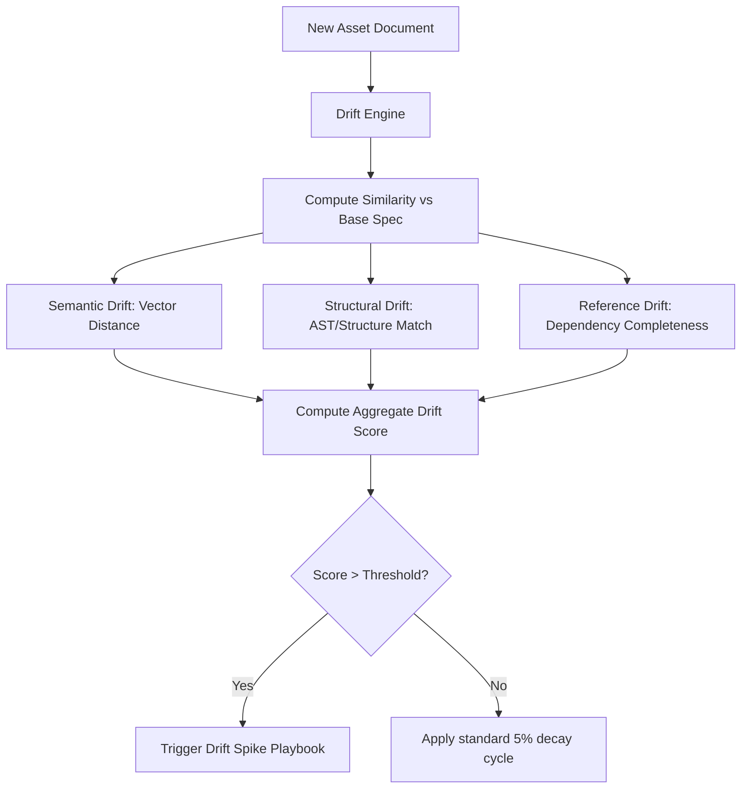

# Drift Classification Models

Drift detection measures the semantic, structural, and reference divergence between document versions or between runtime execution outputs and target specifications.

## Drift Evaluation Flow

---

## 🔬 1. Drift Classifications

The system categorizes drift into three main types:

| Drift Type | Focus | Metric Used |
|---|---|---|
| **Semantic Drift** | Contextual meaning & intent shift | Cosine distance of text embeddings |
| **Structural Drift** | Schema and document hierarchy modifications | Tree edit distance / field count matching |
| **Reference Drift** | Missing file links, API nodes, and edges | Graph traversal / unresolved dependencies |

---

## 🧮 2. Ingestion Penalty Algorithm

When a drift event is logged via the ingestion log daemon, the drift score is updated according to the degree of breach:
* **Minimal Drift ($\text{drift} < 0.2$):** No penalty applied.
* **Moderate Drift ($0.2 \le \text{drift} < 0.4$):** $+0.1$ score penalty.
* **Severe Drift ($0.4 \le \text{drift} < 0.6$):** $+0.3$ score penalty.
* **Critical Drift ($\text{drift} \ge 0.6$):** $+0.5$ score penalty.

All provider drift scores are capped at a maximum of `1.0`.

---

## 📉 3. Uniform Drift Decay

To allow recovery over time, a cron daemon executes a decay cycle every 30 seconds:
* Every provider's drift score is reduced by **5% of its current value**.
* Decay is logged directly in the governance audit trail.
* Scores that decay below `0.01` are snapped to exactly `0.00` to prevent infinite fractional tailing.
