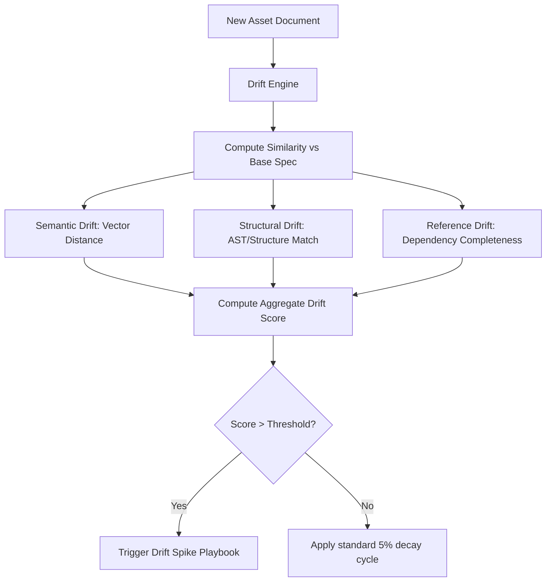

# Drift Classification Models

Drift detection measures the semantic, structural, and reference divergence between document versions or between runtime execution outputs and target specifications.

## Drift Detector Disambiguation — four distinct systems

The repo contains **four separate drift detectors** with different purposes. Do not conflate them:

| System | Path | Purpose | Invocation |
|--------|------|---------|------------|
| Visual drift detector | `scripts/drift-detector.js` | Pixel-level visual regressions across dashboard panels (pixelmatch + PNG) | `node scripts/drift-detector.js [--baseline\|--compare\|--report]` |
| Docker image drift detector | `scripts/docker-drift-detector.js` | Detects stale Docker images vs source (source hash vs image label hash) | `node scripts/docker-drift-detector.js [--manifest ...] [--watch] [--json]` |
| Ingestion/governance drift engine | `cic-ingestion/src/drift/` (`driftEngine.ts`, `DriftDetectorEngine.ts`, `grok-drift.ts`) + root `drift-detector.ts` | Provider drift scoring from SLA breaches (penalty/decay, audited); DB-backed alerts; corpus-hash drift; CIC-vs-CodeFlow lag | Library code; wired into ingestion daemon + governance audit trail |
| Work-summarizer drift detector | `toolforge/skills/work-summarizer/src/drift-detector.ts` | Session-scan drift signals (keyword-based) for the work-summarizer skill | Runs inside the work-summarizer skill |

This page documents the classification model behind the **ingestion/governance drift engine** (row 3). Score decay math: [Drift Engine](../cic/driftengine.md).

## Drift → Routing → Cost loop

Provider drift scores live in `governance/cicState.json` and drive routing:

1. SLA breach (latency/tokens/backlog per `slaSettings`) → penalty added to provider's drift score.
2. Score decays 5% every 30s (audited as `drift_decay` events).
3. Router de-prioritizes providers over `SLA_DRIFT_THRESHOLD` (0.5); freezes routing at critical drift (>0.8) — see [Routing](routing.md).
4. Threshold breaches toggle playbooks (driftSpike, routingStability, backendRecovery…) and can freeze promotions/rollbacks.
5. Token usage feeds cost digests — see [Cost Tracking](../operations/cost-tracking.md).

## Drift Evaluation Flow

---

## 🔬 1. Drift Classifications

The system categorizes drift into three main types:

| Drift Type | Focus | Metric Used |
|---|---|---|
| **Semantic Drift** | Contextual meaning & intent shift | Cosine distance of text embeddings |
| **Structural Drift** | Schema and document hierarchy modifications | Tree edit distance / field count matching |
| **Reference Drift** | Missing file links, API nodes, and edges | Graph traversal / unresolved dependencies |

---

## 🧮 2. Ingestion Penalty Algorithm

When a drift event is logged via the ingestion log daemon, the drift score is updated according to the degree of breach:
* **Minimal Drift ($\text{drift} < 0.2$):** No penalty applied.
* **Moderate Drift ($0.2 \le \text{drift} < 0.4$):** $+0.1$ score penalty.
* **Severe Drift ($0.4 \le \text{drift} < 0.6$):** $+0.3$ score penalty.
* **Critical Drift ($\text{drift} \ge 0.6$):** $+0.5$ score penalty.

All provider drift scores are capped at a maximum of `1.0`.

---

## 📉 3. Uniform Drift Decay

To allow recovery over time, a cron daemon executes a decay cycle every 30 seconds:
* Every provider's drift score is reduced by **5% of its current value**.
* Decay is logged directly in the governance audit trail.
* Scores that decay below `0.01` are snapped to exactly `0.00` to prevent infinite fractional tailing.
