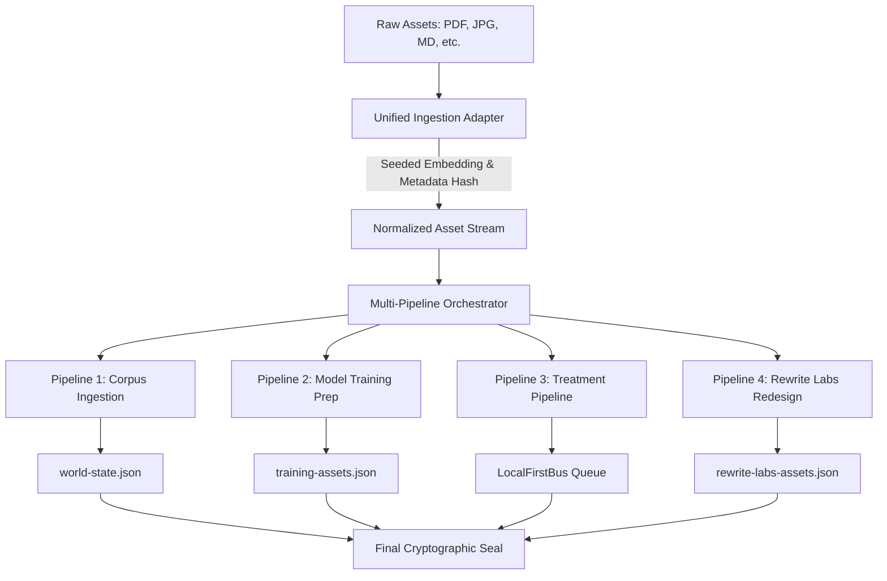

# Multi-Pipeline Ingestion & Ingestion Trace

The Ingestion layer is responsible for taking raw assets (documents, images), normalizing them, and fanning them out into four deterministic pipelines: Corpus, Model Training Prep, Treatment, and Rewrite Labs Redesign.

## Where ingestion lives (real paths)

- **Stage config:** `roadmap-runner/ingestion-config.json` defines the CIC + TorqueQuery pipeline as four named stages — **Crawler** (seed_urls → raw_html, 300s), **Scraper** (raw_html → documents, 600s), **Mapper** (documents → IRPackets, 300s), **Indexer** (IRPackets → search_index, 900s) — with retry (3 attempts, 30s backoff). These are *config stage names*, not code directories.
- **Code:** `cic-ingestion/src/` — `harvester/` (extraction, incl. v2), `drift/` (drift engines fed by ingestion), plus adapters/extractors/vector modules.
- **Downstream flows:** ingestion output feeds governance drift scoring (`governance/cicState.json`), the [roadmap runner](../operations/roadmap-runner.md) ingestion phases, and the knowledge graph.

## Ingestion Architecture



---

## 🛡️ 1. Unified Ingestion Adapter

The adapter runs 100% deterministically with **no network calls** and **no random number generation (RNG)**.
* **Text Embedding:** Seeded using the SHA-256 hash of the content, generating a 768-dimensional float array.
* **Image Embedding:** Seeded using the SHA-256 hash of the binary buffer.
* **Asset ID:** A SHA-256 hash computed over `type:rawPath:contentHash`.

---

## 📑 2. Ingestion Trace Schema

Every ingestion run emits a complete execution trace to `audit/runs/<runId>.json` for auditing and lineage verification.

### Trace Schema JSON
```json
{
  "executionTrace": {
    "taskId": "string (run ID)",
    "task": "multi-pipeline-ingestion",
    "localFirst": true,
    "timestamp": 0,
    "fingerprint": "string (SHA256 of sorted input paths)",
    "regimeSelected": "local-first",
    "input": {
      "docCount": 1,
      "imageCount": 1
    },
    "normalizedAssets": {
      "totalCount": 2,
      "byType": {
        "document": 1,
        "image": 1
      }
    },
    "pipelines": {
      "corpus": {
        "status": "success",
        "assetIds": ["string"],
        "hash": "string (SHA256 of sorted asset IDs)"
      },
      "modelTraining": {
        "status": "success",
        "assetIds": ["string"],
        "hash": "string (SHA256 of training metadata)"
      },
      "treatment": {
        "status": "success",
        "hash": "string (SHA256 of message metadata)",
        "messageCount": 2
      },
      "rewriteLabs": {
        "status": "success",
        "assetIds": ["string"],
        "hash": "string (SHA256 of rewrite seeds)"
      }
    },
    "messages": [
      {
        "id": "string",
        "from": "cic-ingestion",
        "to": "treatment-pipeline",
        "type": "evidence_item",
        "payload": {
          "assetId": "string",
          "type": "string",
          "metadataHash": "string",
          "embeddingHash": "string"
        },
        "payloadHash": "string",
        "prevId": "string | null",
        "timestamp": 0
      }
    ],
    "result": {
      "status": "success",
      "finalSealHash": "string (combined hash of all 4 pipeline hashes)",
      "payloadHash": "string",
      "snapshotHash": "string"
    }
  }
}
```

---

## 🔄 3. World-State Delta Schema

Ingestion triggers delta updates in three main system database layers. The difference between states is represented by a `multi-pipeline-delta.json` file.

```json
{
  "multiPipelineDelta": {
    "version": "1.0.0",
    "localFirst": true,
    "changes": [
      {
        "component": "world-state",
        "field": "ingestedAssets",
        "operation": "append",
        "from": "[]",
        "to": "[<array of asset IDs>]"
      },
      {
        "component": "data/training-assets",
        "field": "root",
        "operation": "write",
        "from": "[]",
        "to": "[<array of training metadata>]"
      },
      {
        "component": "data/rewrite-labs-assets",
        "field": "root",
        "operation": "write",
        "from": "[]",
        "to": "[<array of rewrite seeds>]"
      }
    ],
    "assetCount": 2,
    "completed": "2026-06-29T00:00:00Z"
  }
}
```
