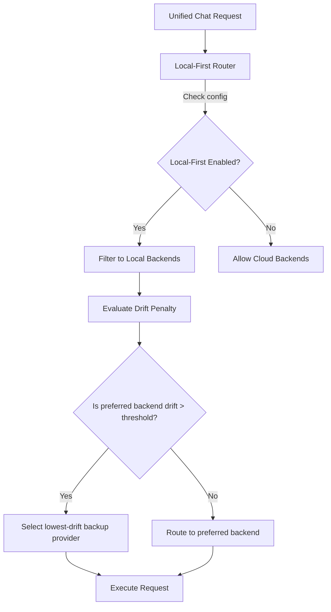

# Routing Engine & Policies

The Routing layer manages how requests are mapped to different backend LLM providers (e.g., Ollama, Llamafile, Mock) based on local-first constraints, performance metrics, and active drift scores.

## Routing System Design

---

## ⚙️ 1. Local-First Constraints

When `localFirst` mode is enabled in runtime configuration:
* Cloud backends are completely isolated and bypassed.
* All processing must remain on-device or within local network boundaries.
* The system chooses from registered local backends: `ollama`, `llamafile`, and `mock` (resilience provider).

---

## 📈 2. Drift-Aware Adaptive Routing

The router queries the live `CICState` to obtain the calculated drift scores of all registered providers.
* Each provider starts with a drift score of `0.0`.
* High token usage or latency breaches penalize the provider, increasing its score.
* Providers with drift scores exceeding the `SLA_DRIFT_THRESHOLD` (default: `0.5`) are de-prioritized.
* If a provider reaches critical drift (`>0.8`), routing to it is frozen, and requests fall back to the healthiest available local alternative.

---

## 🛡️ 3. SLA Failover Policies

In the event of a provider failure or latency spike, the router triggers recovery playbooks:
* **Backend Recovery Playbook:** Initiated if the primary provider becomes unresponsive.
* **Routing Stability Playbook:** Freezes routing to a known-stable backend to prevent routing oscillation if backend performance fluctuates.
