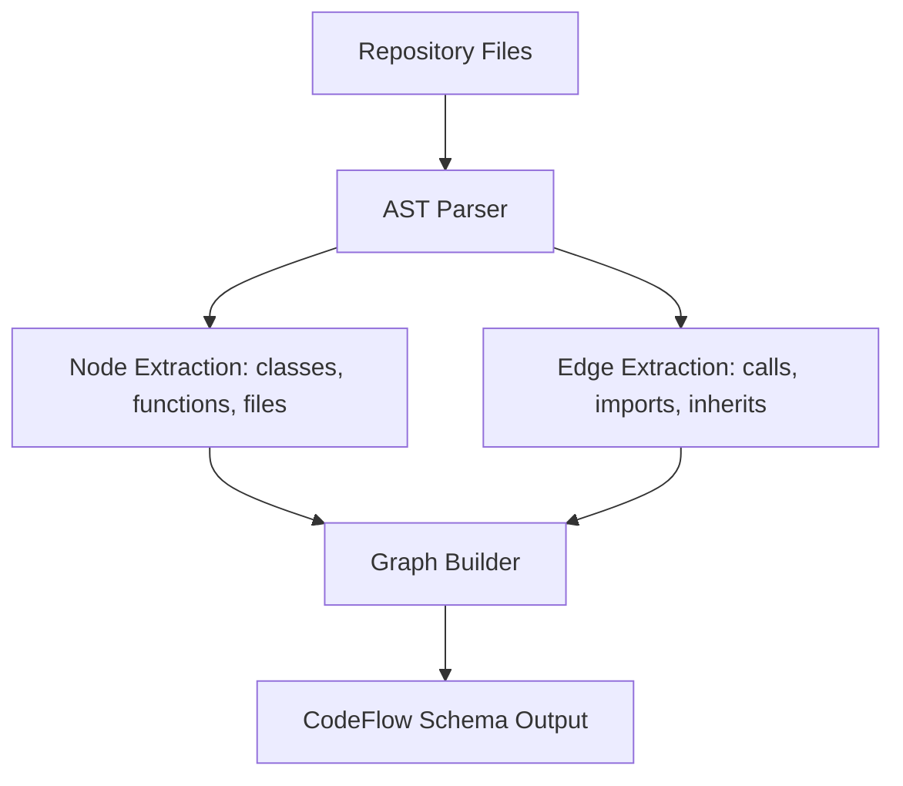

# CodeFlow Harvester & Extractor

The Harvester component extracts semantic structures, dependency edges, security findings, and patterns from repositories to build a deterministic representation of code assets.

## Harvester Pipeline



---

## 🔍 1. Harvester Mechanics

The harvester processes repositories file-by-file, building an abstract syntax tree (AST) to map code relationships.
* **Nodes:** Code symbols including class declarations, interface definitions, function signatures, and files.
* **Edges:** Imports, call graphs (function A calls function B), and inheritance maps.
* **Security Findings:** Static code analysis warnings (e.g., hardcoded secrets, open ports).

---

## 📝 2. CodeFlow Schema Output

The result of the Harvester run is exported as a unified JSON schema containing the following metadata blocks:

```json
{
  "repoId": "string",
  "extracted": {
    "nodes": 1250,
    "edges": 4500,
    "security": 12,
    "patterns": 85,
    "impact": 3
  },
  "duration_ms": 1420
}
```
