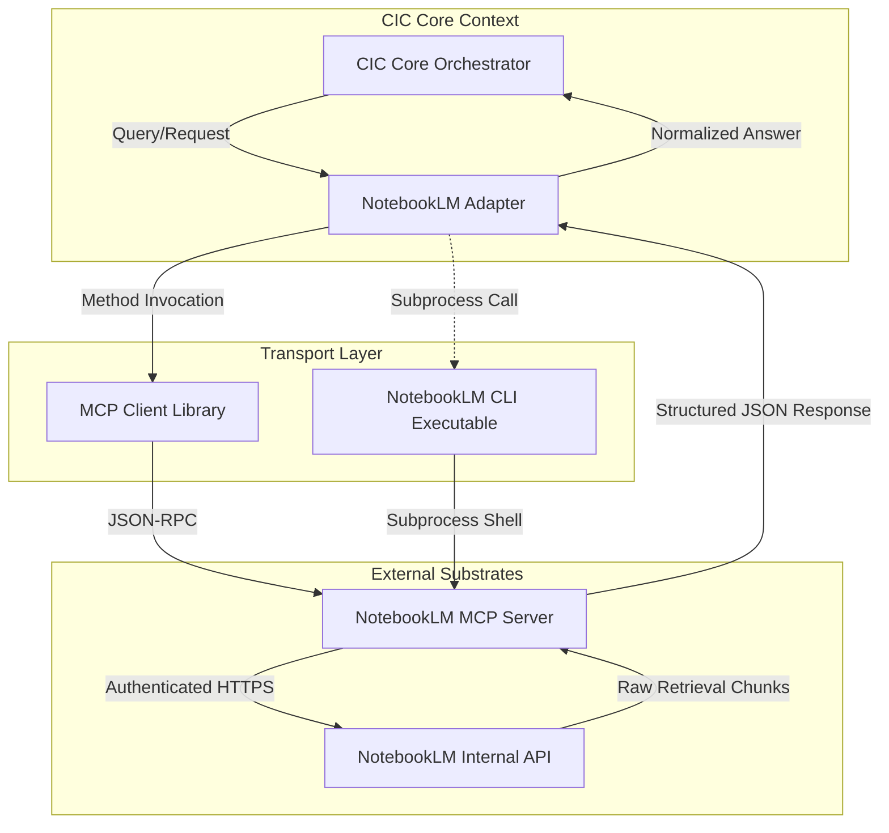

# CIC NotebookLM Adapter Specification

**Status:** Proposed / Under Review  
**Date:** 2026-07-08  
**Location:** `docs/cic/notebooklm-adapter-spec.md`  

---

## 1. Executive Summary & Core Objective

NotebookLM is a highly capable product but lacks a native public API. This integration specification introduces the **CIC NotebookLM Adapter**, transforming NotebookLM from a UI-locked container into a programmable, queryable, and machine-consumable knowledge substrate. By utilizing a standardized CLI and MCP (Model Context Protocol) server model, CIC agents can programmatically fetch structured source context, retrieve semantic summaries, and perform grounded document auditing without scraping or browser automation.

> [!NOTE]
> This adapter serves as a first-class knowledge bridge for the Content Intelligence Core (CIC), TorqueQuery, and Rewrite Labs, allowing them to treat NotebookLM notebooks as an indexed long-term memory layer.

---

## 2. High-Level Architecture & Data Flow

The NotebookLM Adapter decouples the orchestrator from NotebookLM’s transport-level specifics (Google session authentication and internal API interactions).

### 2.1 Component Interaction



### 2.2 Process Isolation Boundary

* **Host Separation**: The MCP server runs as an independent daemon or sidecar process, maintaining its own authenticated Google session context.
* **Adapter Footprint**: The `NotebookLM Adapter` within CIC is a lightweight, stateless Python library that interacts strictly through JSON-RPC over stdio (MCP) or JSON output files (CLI).
* **Zero credential leak**: Credentials, cookie jars, and token caches remain strictly inside the `notebooklm_mcp` process namespace. The adapter never parses or reads Google account credentials.

---

## 3. Six Rules Discipline Alignment

To maintain the high reliability standards of CIC OS, the NotebookLM Adapter integrates directly with the [Six Rules Framework](six-rules-framework.md):

| Six Rules Principle | Implementation Pattern in Adapter | Machine-Verifiable Gate |
| :--- | :--- | :--- |
| **1. Verification First** | Every query execution path must be validated by reproducing expected retrieval states via test mock fixtures before production deployment. | Jest/Python unit tests verifying adapter behavior under simulated 500/403 network conditions. |
| **2. Define Done** | Clear schema boundaries for `NotebookAnswer` and `NotebookChunk`. If return payloads lack expected attributes, they fail immediately. | JSON schema validation of all adapter outputs. |
| **3. Deterministic Debugging** | Capture all outbound parameters, CLI arguments, and raw JSON-RPC packages in debug manifests to recreate retrieval bugs. | Query-hash logging (`/data/debug-adapter-runs.jsonl`) to allow replay testing. |
| **4. Dependency Skepticism** | Avoid introducing external scraping engines (e.g., Puppeteer, Playwright) or heavyweight LLM packages inside the adapter module. | Strict dependency whitelist in the adapter's package configuration. |
| **5. Surface Uncertainty** | The adapter must extract and surface NotebookLM's confidence signals and source-citation gaps to the orchestrator. | Confidence metric (`confidence: float`) and citation coverage check. |
| **6. Failure Mode Self-Recognition** | Auto-detection of token-drift, rate-limiting, and expired cookies, trigger immediate halts to prevent silent failures. | Active adapter health checks raising typed exceptions before execution. |

---

## 4. Interfaces & Data Structures

### 4.1 Interface Methods (Python 3.10+)

```python
from datetime import date, datetime
from typing import List, Optional, TypedDict

class NotebookFilters(TypedDict, total=False):
    start_date: Optional[date]
    end_date: Optional[date]
    section_ids: Optional[List[str]]
    tags: Optional[List[str]]
    max_chunks: Optional[int]

class NotebookChunk(TypedDict):
    id: str
    notebook_id: str
    section_id: Optional[str]
    title: Optional[str]
    content: str
    source_type: str  # e.g., 'note', 'imported_doc', 'summary'
    created_at: Optional[datetime]
    updated_at: Optional[datetime]

class NotebookAnswerMetadata(TypedDict):
    notebook_id: str
    query: str
    timestamp: datetime
    mcp_tool_name: str
    raw_response: dict
    confidence: Optional[float]

class NotebookAnswer(TypedDict):
    answer_text: str
    supporting_chunks: List[NotebookChunk]
    metadata: NotebookAnswerMetadata

class NotebookSummary(TypedDict):
    id: str
    title: str
    description: Optional[str]
    tags: List[str]
    last_updated: Optional[datetime]

class AdapterHealthStatus(TypedDict):
    status: str  # "OK", "UNAUTHENTICATED", "UNREACHABLE", "DEGRADED"
    latency_ms: float
    error_message: Optional[str]
```

### 4.2 Core API Methods

```python
def query_notebook(
    notebook_id: str, 
    query: str, 
    *, 
    filters: Optional[NotebookFilters] = None
) -> NotebookAnswer:
    """
    Submits a query to a specific NotebookLM notebook and returns a structured answer 
    with detailed source citations.
    """
    pass

def search_notebooks(query: str) -> List[NotebookSummary]:
    """
    Scans the titles and descriptions of all visible notebooks to locate matches 
    for a given keyword or topic.
    """
    pass

def list_notebooks() -> List[NotebookSummary]:
    """
    Returns metadata for all notebooks accessible by the authenticated session.
    """
    pass

def health_check() -> AdapterHealthStatus:
    """
    Verifies that the underlying MCP server is reachable and session auth is valid.
    """
    pass
```

---

## 5. Transport Layer: MCP vs. CLI

> [!IMPORTANT]
> The primary communication path is MCP over stdio (JSON-RPC 2.0). The CLI fallback is used only in isolated container scenarios where a persistent daemon process is not feasible.

### 5.1 MCP Client Contracts

#### `notebooklm.list_notebooks`
* **Request Parameters**: None
* **Expected Response Schema**:
```json
{
  "notebooks": [
    {
      "id": "nb_8a2d3e4f",
      "title": "Rewrite Labs Redesign Briefs",
      "description": "Client discovery notes and style-guides",
      "tags": ["rewrite-labs", "redesign", "style-guide"],
      "last_updated": "2026-07-08T18:30:00Z"
    }
  ]
}
```

#### `notebooklm.ask`
* **Request Parameters**:
```json
{
  "notebook_id": "nb_8a2d3e4f",
  "query": "What are the client's color palette requirements?",
  "filters": {
    "max_chunks": 3
  }
}
```
* **Expected Response Schema**:
```json
{
  "answer": "The client requires a Slate primary color with Indigo accent colors...",
  "chunks": [
    {
      "id": "chunk_90123",
      "notebook_id": "nb_8a2d3e4f",
      "section_id": "sec_discovery_01",
      "title": "Initial Interview Notes",
      "content": "Use Slate and Indigo, avoid standard browser primary colors.",
      "source_type": "imported_doc",
      "created_at": "2026-07-01T10:00:00Z",
      "updated_at": "2026-07-01T10:00:00Z"
    }
  ]
}
```

### 5.2 CLI Fallback Execution Contract

If configured for CLI mode, the adapter runs a subprocess invocation with strict stdout parsing rules.

```bash
python -m notebooklm_mcp ask "query" --notebook <id> --output json
```

* **Exit Code Policy**: Non-zero codes must be intercepted and converted into typed exceptions.
* **Output Format**: Stdout must emit standard JSON only. Diagnostics, warnings, and log info must go to stderr.

---

## 6. Error Handling & Resilience Matrix

```
                          [Query Error Intercepted]
                                     |
             +-----------------------+-----------------------+
             |                                               |
     [Is Auth Error?]                               [Is Timeout/Rate Limit?]
             |                                               |
     (NotebookLMAuthError)                       (NotebookLMTimeoutError)
             |                                               |
     [Halt Autonomy Loop]                         [Execute Linear Backoff]
             |                                               |
  (Raise Operator Notification)                   [Failure?] -> Fail Fast
```

* **`NotebookLMAuthError`**: Google session cookies expired or invalid. **Resolution Strategy:** Halt execution immediately, raise an alert on the dashboard, and await operator re-authentication.
* **`NotebookLMUnavailableError`**: Server not listening or subprocess missing. **Resolution Strategy:** Verify executable path, check if service daemon needs restart.
* **`NotebookLMProtocolError`**: Raw payload missing required fields. **Resolution Strategy:** Raise error immediately. No partial object assembly to prevent drift.
* **`NotebookLMTimeoutError`**: NotebookLM API response timed out. **Resolution Strategy:** Configurable single retry with 2.0x backoff, then fail-fast.

---

## 7. Configuration Specifications

### 7.1 Adapter Configuration (`notebooklm_adapter.yaml`)

```yaml
mode: "mcp" # "mcp" | "cli"

mcp:
  transport: "stdio" # "stdio" | "sse"
  # host/port only required when transport is "sse"
  host: "localhost"
  port: 8080
  tool_names:
    list_notebooks: "notebooklm.list_notebooks"
    ask: "notebooklm.ask"

cli:
  python_executable: "python"
  module: "notebooklm_mcp"
  default_args: ["--output", "json"]

timeouts:
  ask_ms: 15000
  list_ms: 5000

limits:
  max_chunks: 5
  max_answer_length: 2000

logging:
  level: "INFO"
  mask_sensitive_data: true
```

### 7.2 Core Mapping Configuration (`cic_notebooks.yaml`)

This map isolates agent files from hardcoded IDs:

```yaml
notebook_mappings:
  client_briefs: "nb_8a2d3e4f"
  financial_audits: "nb_9b7c8d9e"
  technical_kb: "nb_0c1d2e3f"
```

---

## 8. Data Security & Provenance

* **No Credentials Stored**: The adapter never prompts for, accepts, or stores credentials. It relies on the pre-authenticated environment of the local `notebooklm_mcp` client.
* **PII Masking**: Logging levels default to masking context chunk text. Only chunk hashes, query text metadata, and notebook identifiers are logged to the central audit ledger.
* **Audit Trail integration**: Every query result must generate a provenance record containing:
  ```json
  {
    "provenance_hash": "sha256_...",
    "source_notebook": "nb_8a2d3e4f",
    "timestamp": "2026-07-08T18:30:00Z",
    "query_executed": "...",
    "referenced_chunks": ["chunk_90123"]
  }
  ```

---

## 9. Verification & Testing Plan

### 9.1 Automated Test Suite (pytest / Python unittest)
* **Contract Verification**: Run contract-validating unit tests using JSON schema fixtures to confirm compatibility with the MCP output schema.
* **Timeout & Failure Mocking**: Mock the transport connection to drop queries, verifying that `NotebookLMTimeoutError` and `NotebookLMAuthError` are thrown and processed deterministically.
* **Validation Command**:
  ```bash
  pytest tests/test_notebooklm_adapter.py
  ```

### 9.2 Manual Validation Gate
1. Spin up the local `notebooklm_mcp` server.
2. Trigger the health-check query CLI command manually:
   ```bash
   python -m notebooklm_mcp health --check
   ```
3. Verify output returns status `OK` with current authentication timestamp.

---

## See Also

* [Six Rules Framework](six-rules-framework.md) — Operational integration guidelines.
* [TorqueQuery MCP Reference](torquequery-mcp-reference.md) — Reference for sibling retrieval server.
* [System Index Builder](../reference/system-index-builder.md) — Broad documentation crawler.
