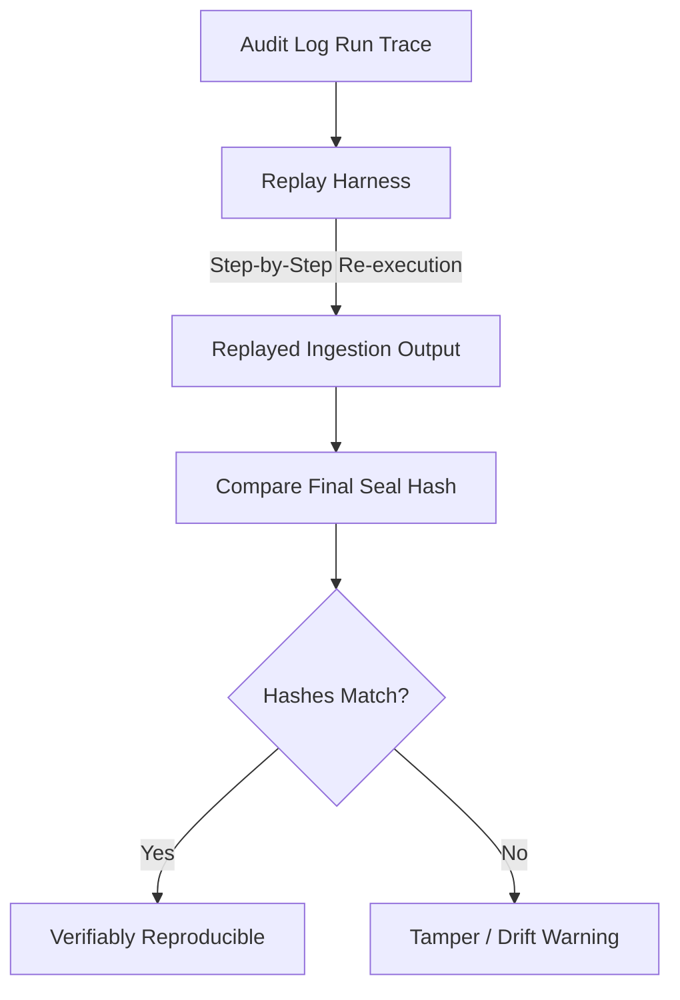

# Replay Harness & Verification

The Replay Harness ensures that ingestion runs can be reproduced identically by executing the exact sequence of steps from an audit run.

## Replay Validation Flow



---

## 📑 1. Replay Script Schema

A replay script contains all normalized input assets, routing regimes, and expected intermediate hashes.

```json
{
  "replayScript": {
    "runId": "ingest-001",
    "localFirst": true,
    "steps": [
      {
        "step": "loadInputs",
        "docs": ["docs/doc1.pdf"],
        "images": ["images/img1.jpg"]
      },
      {
        "step": "fingerprint",
        "task": "ingest_docs_and_images",
        "tokens": 512,
        "latencyClass": "medium"
      },
      {
        "step": "route",
        "regime": "local-medium",
        "agents": ["cic-api", "onnx"]
      },
      {
        "step": "normalize",
        "normalizedAssets": [
          "doc-docs/doc1.pdf",
          "img-images/img1.jpg"
        ]
      },
      {
        "step": "runPipelines",
        "pipelines": {
          "corpus": "complete",
          "modelTraining": "prepared",
          "treatment": "queued",
          "rewriteLabs": "generated"
        }
      }
    ],
    "result": {
      "status": "replay-complete",
      "snapshotHash": "b541117a7d6f88873b6fd776d2ca2382a05aac78b5612a8627956204810fb33d",
      "finalSealHash": "f1c256c8683fc469ef239cf7090e3807a3e412f00d76ce32e3c6b376f8ec61c3"
    }
  }
}
```
