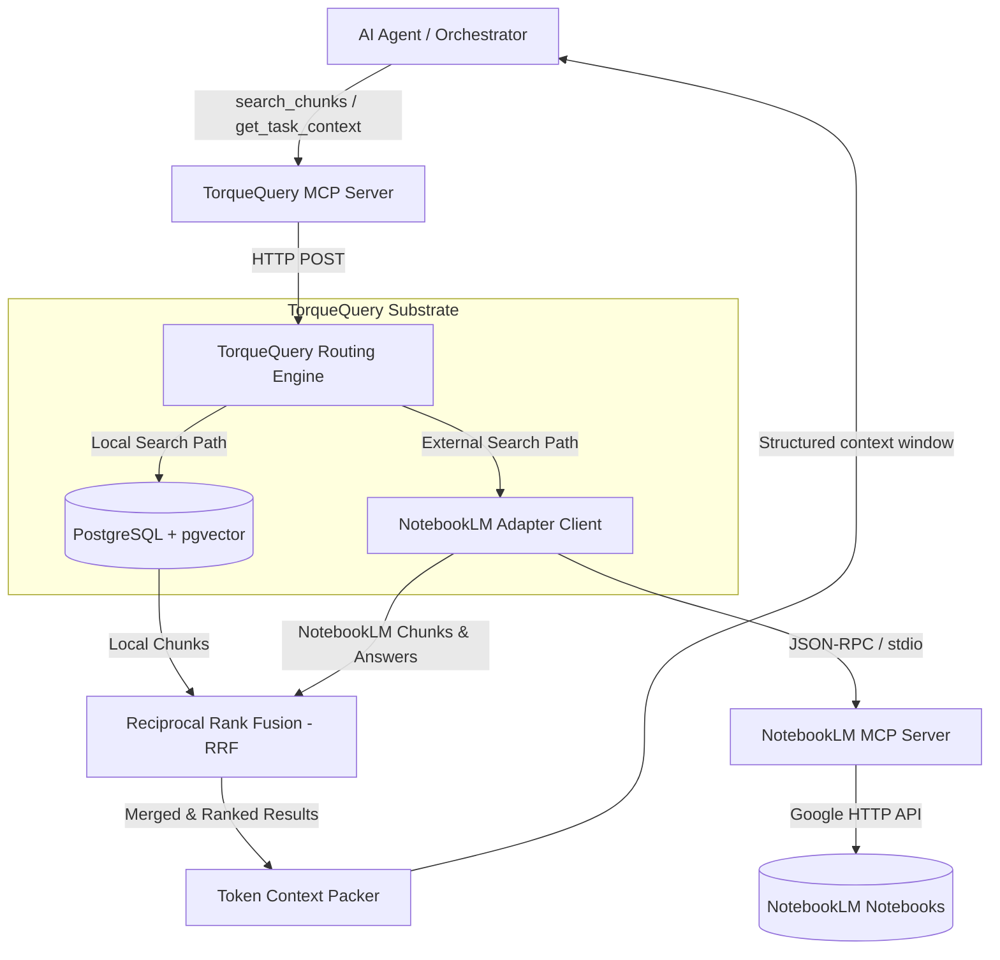

# TorqueQuery NotebookLM Module Specification

**Status:** Proposed / Under Review  
**Date:** 2026-07-08  
**Location:** `docs/cic/torquequery-notebooklm-spec.md`  

---

## 1. Executive Summary & Objectives

TorqueQuery acts as the central semantic database and context-packing orchestrator for the Content Intelligence Core (CIC). While TorqueQuery excels at querying localized high-density vector chunks, it lacks connection to dynamic external document corpora. 

This specification defines the **TorqueQuery NotebookLM Module**, an architectural extension that embeds the [NotebookLM Adapter](notebooklm-adapter-spec.md) directly into the TorqueQuery retrieval pipeline. By doing so, TorqueQuery gains two primary capabilities:
1. **Federated Hybrid Retrieval**: Dynamic fusion of local database results (pgvector + BM25) and real-time NotebookLM notebook queries.
2. **Namespace Federated Mapping**: Routing namespace queries directly to corresponding Google NotebookLM corpora.

---

## 2. Integrated Data Flow & Routing Architecture

The module introduces a routing engine that intercept incoming TorqueQuery requests and decides whether to fetch from local PostgreSQL storage, the external NotebookLM Adapter, or both.



---

## 3. Core Capabilities & Mechanics

### 3.1 Namespace-to-Notebook Mapping
TorqueQuery organizes knowledge via namespaces. This module introduces a configuration mapping that links TorqueQuery namespaces to unique NotebookLM notebook IDs.

* **Local Namespace**: Traditional namespace resolving to database-only queries (e.g. `state_snapshots`).
* **Federated Namespace**: A namespace that maps directly to a NotebookLM notebook (e.g., `client_briefs` -> `nb_8a2d3e4f`).
* **Fallback Resolution**: If a query is targeted at a federated namespace and the NotebookLM server is offline, the routing engine falls back to the local database cache for that namespace.

### 3.2 Federated Hybrid Retrieval (pgvector + NotebookLM)
When performing a search, the orchestrator can request a federated retrieval. The routing engine:
1. Executes a local hybrid search (BM25 + Cosine Similarity on `tq_vectors`).
2. Dispatches a parallel query to the mapped NotebookLM notebook using the adapter.
3. Fuses both result sets using Reciprocal Rank Fusion (RRF):

$$RRF\_Score(d) = \sum_{m \in M} \frac{1}{60 + Rank_m(d)}$$

Where $M$ represents the search backends (Local DB, NotebookLM Chunks).

---

## 4. Governance & Constraints Enforcement

Data retrieved from NotebookLM must be normalized to satisfy TorqueQuery's strict governance rules before entering the context packing layer:

| Governance Rule | NotebookLM Mapping Behavior | Enforcement Action |
| :--- | :--- | :--- |
| **Chunk Type Forced** | All incoming chunks from NotebookLM mapped as `LIVING` (permanent, read-only documentation) or `SYSTEM`. | Set `chunk_type = "LIVING"`. |
| **Provenance Tracking** | Must capture exact source notebook and chunk metadata. | Map `provenance.source = "notebooklm:{notebook_id}:{chunk_id}"`. |
| **Max Body size** | Chunks exceeding 100KB must be rejected or split. | Truncate/warn if chunk size > 100KB. |
| **Importance Clamping** | Map NotebookLM retrieval scores to standard $[0.0, 1.0]$ range. | Normalize confidence score to `importance` value. |

---

## 5. API Extensions & MCP Contracts

### 5.1 Substrate Endpoint Extensions

#### `POST /search/federated`
Submits a search query to be resolved across both the local database and NotebookLM.

* **Request Body**:
```json
{
  "query": "client brand colors",
  "namespaces": ["client_briefs"],
  "limit": 5,
  "options": {
    "rrf_constant": 60,
    "include_notebooklm": true,
    "notebooklm_weight": 1.2
  }
}
```

* **Response Body**:
```json
{
  "results": [
    {
      "chunk_id": "nb_chunk_102",
      "body": "Brand colors are Slate Primary, Indigo Accent.",
      "importance": 0.95,
      "namespace": "client_briefs",
      "provenance": {
        "source": "notebooklm:nb_8a2d3e4f:chunk_102",
        "timestamp": "2026-07-08T20:00:00Z"
      },
      "fused_score": 0.032
    }
  ]
}
```

### 5.2 Extended MCP Tools

#### `search_federated_chunks`
Exposes the federated search capability directly to AI agents.

* **Tool Description**: `Search chunks across local database indexes and federated NotebookLM notebooks.`
* **Schema Definition**:
```json
{
  "name": "search_federated_chunks",
  "parameters": {
    "type": "object",
    "properties": {
      "query": { "type": "string", "description": "Natural language query" },
      "namespaces": { "type": "array", "items": { "type": "string" } },
      "limit": { "type": "integer", "default": 5 }
    },
    "required": ["query"]
  }
}
```

---

## 6. Resilience & Error States

The module follows the **Failure Mode Self-Recognition** rule, implementing specific recovery scenarios:

1. **Adapter Disconnect**: If the NotebookLM MCP server throws `NotebookLMUnavailableError`, TorqueQuery marks the namespace as `Degraded`, logs the failure in `/data/tq-error.log`, and continues query processing using the cached local database chunks.
2. **Rate Limiting**: If NotebookLM returns HTTP 429, the module aborts the federated path and returns only local results, flagging the response metadata with `"notebooklm_partial_results": true`.
3. **Invalid Schema**: If the adapter returns malformed chunk schemas, the governance pipeline rejects the payload entirely to prevent corrupted vectors from entering the cache.

---

## 7. Verification & Implementation Roadmap

```
Phase 1: Adapter Mocking  ==>  Phase 2: Router Routing  ==>  Phase 3: RRF Integration
   (Write Mock Tests)            (Validate Namespaces)           (Verify Fused Ranks)
```

### 7.1 Automated Integration Tests
* **Mock Testing**: Intercept adapter invocations with static json fixtures (e.g. `tests/fixtures/notebooklm_mock.json`) to run assertions without live Google authentication.
* **Verification Command**:
  ```bash
  pytest tests/test_torquequery_notebooklm.py
  ```

---

## See Also

* [NotebookLM Adapter Spec](notebooklm-adapter-spec.md) — Base adapter interface.
* [TorqueQuery Executive Summary](torquequery-executive-summary.md) — Baseline TorqueQuery details.
* [Six Rules Framework](six-rules-framework.md) — Operational integration guidelines.
