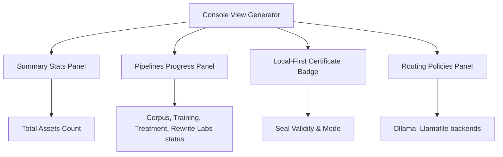

# Operator Console View & Dashboard

The Operator Dashboard provides a live unified control panel for reviewing the status of running ingestion pipelines, routing configurations, and local-first cryptographic certificates.

## Dashboard Components



---

## 🖥️ 1. Operator Console JSON Schema

The dashboard UI consumes execution traces and renders them via `data/console/<runId>-console.json`.

```json
{
  "operatorConsoleView": {
    "runId": "ingest-001",
    "mode": "local-first",
    "status": "success",
    "summary": {
      "totalAssetsProcessed": 2,
      "pipelineCount": 4,
      "pipelineStatuses": {
        "corpus": "success",
        "modelTraining": "success",
        "treatment": "success",
        "rewriteLabs": "success"
      },
      "finalSealHash": "f1c256c8683fc469ef239cf7090e3807a3e412f00d76ce32e3c6b376f8ec61c3",
      "snapshotHash": "b541117a7d6f88873b6fd776d2ca2382a05aac78b5612a8627956204810fb33d"
    },
    "pipelines": [
      {
        "name": "corpus",
        "status": "success",
        "assetCount": 2,
        "messageCount": 0,
        "hash": "931a6419ce3978e202725ce9ab93453bd2402cb2149feb4a865d841f394703f5"
      },
      {
        "name": "modelTraining",
        "status": "success",
        "assetCount": 2,
        "messageCount": 0,
        "hash": "f82ed30496897afe7f3492b8b9a34a564768a2bbf553f8f3425f45e561056997"
      },
      {
        "name": "treatment",
        "status": "success",
        "assetCount": 0,
        "messageCount": 2,
        "hash": "a1b3a0f1e5d55ef33462470915ef32a0933a1bc8f2cbbb2252ad32e59408d91d"
      },
      {
        "name": "rewriteLabs",
        "status": "success",
        "assetCount": 2,
        "messageCount": 0,
        "hash": "e1ebf72d6b3d2cb873f54b361f8c2988f42af6f9cd2367cc29058781c9ca8400"
      }
    ],
    "routing": {
      "regime": "local-first",
      "localFirstEnabled": true,
      "backends": ["ollama", "llamafile", "mock"]
    },
    "certificates": {
      "localFirst": true,
      "deterministic": true,
      "sealed": true
    }
  }
}
```

---

## 📄 2. Human-Readable Report Example

The console view generator produces plain text summaries of ingestion run details:

```text
=== Operator Console Report ===
Run ID: ingest-001
Mode: local-first
Status: success

Summary:
  Total Assets: 2
  Pipelines: 4
  Final Seal Hash: f1c256c8683fc469...

Pipeline Status:
  corpus: success (2 assets, 0 messages)
  modelTraining: success (2 assets, 0 messages)
  treatment: success (0 assets, 2 messages)
  rewriteLabs: success (2 assets, 0 messages)

Routing:
  Regime: local-first
  Local-First: true
  Backends: ollama, llamafile, mock

Certificates:
  Local-First: true
  Deterministic: true
  Sealed: true
```
