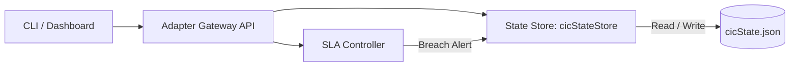

# Adapter Gateway API & State Store

The Adapter Gateway serves as the centralized interface for routing LLM traffic, monitoring SLA breaches, and tracking active playbooks.

## Control Plane Architecture



---

## 🔌 1. API Endpoints

### Ingestion Metrics
* **Endpoint:** `GET /metrics`
* **Response:** Returns the persistent state of all active SLAs, drift scores, processed line counts, and playbook statuses.

### Playbook Management
* **Endpoint:** `POST /admin/playbook/trigger`
* **Body:**
  ```json
  {
    "playbookName": "string",
    "active": true
  }
  ```
* **Purpose:** Forces the manual execution or cancellation of an operational recovery playbook.

* **Endpoint:** `GET /admin/playbook/status`
* **Response:** Returns the list of currently running playbooks.

---

## 💾 2. Persistent State Store

Control plane state is persisted inside `governance/cicState.json` using atomic write patterns (write to temporary file, then rename) to prevent file corruption in high-concurrency environments.

### State Schema
```json
{
  "version": "1.0.0",
  "routingFrozen": false,
  "frozenBackend": "mock",
  "promotionsFrozen": false,
  "rollbacksFrozen": false,
  "violations": [],
  "playbooks": {
    "driftSpike": false,
    "routingStability": false,
    "backendRecovery": false,
    "ingestionRecovery": false
  },
  "metrics": {
    "backlogCount": 0,
    "oscillationCount": 0,
    "averageLatencyMs": 0
  }
}
```
