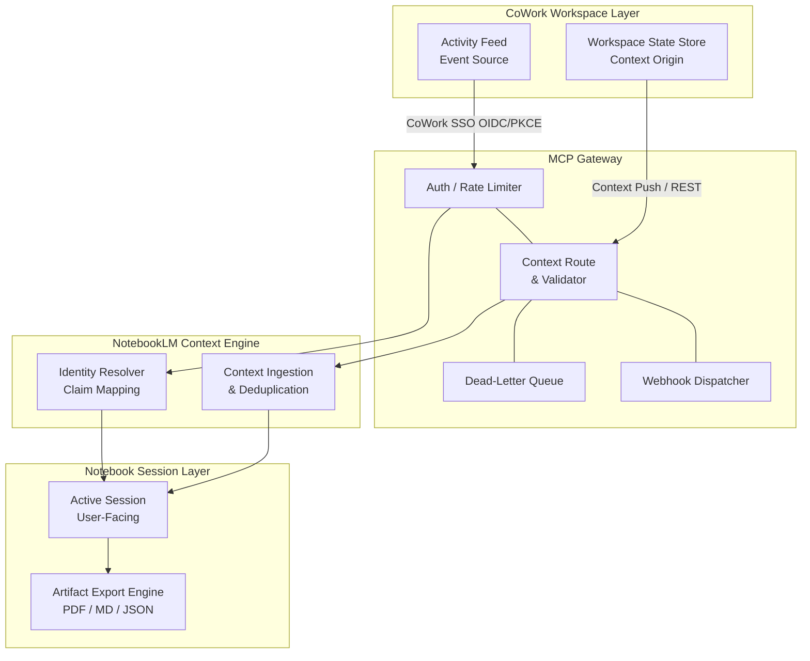

# CoWork MCP Integration Spec

## Multi-Context Protocol Integration — Version 1.2

| Field | Value |
| :--- | :--- |
| **Doc ID** | CIC-SPEC-MCP-001 |
| **Version** | 1.2 |
| **Status** | Draft — Ready for Review |
| **Author** | CIC Integration Team |
| **Date** | 2026-07-09 |
| **Classification** | Internal — Engineering |
| **Cross-References** | CIC-SPEC-NLM-001 ([NotebookLM Core Spec](../cic/notebooklm-integration-plan.md))<br>CIC-ROAD-001 ([v1.2 Roadmap Addendum](../roadmaps/notebooklm-v12-roadmap-addendum.md))<br>CIC-UC-001 ([Expanded Use Case Section](../cic/use-case-library.md)) |

## Table of Contents

1. [Executive Summary](#1--executive-summary)
2. [Scope and Objectives](#2--scope-and-objectives)
    * 2.1 [In-Scope](#21-in-scope)
    * 2.2 [Out-of-Scope](#22-out-of-scope)
    * 2.3 [Objectives](#23-objectives)
3. [System Architecture](#3--system-architecture)
    * 3.1 [Component Diagram](#31-component-diagram)
    * 3.2 [Integration Points](#32-integration-points)
    * 3.3 [Data Flow Description](#33-data-flow-description)
4. [API Specification](#4--api-specification)
    * 4.1 [Authentication](#41-authentication)
    * 4.2 [Context Injection Endpoint](#42-context-injection-endpoint)
    * 4.3 [Session Webhook Registration](#43-session-webhook-registration)
    * 4.4 [Artifact Export API](#44-artifact-export-api)
    * 4.5 [Rate Limits](#45-rate-limits)
5. [Event Schema](#5--event-schema)
    * 5.1 [Standard Event Envelope](#51-standard-event-envelope)
    * 5.2 [Event Types](#52-event-types)
    * 5.3 [Schema Evolution Policy](#53-schema-evolution-policy)
6. [Identity Federation](#6--identity-federation)
    * 6.1 [SSO Architecture](#61-sso-architecture)
    * 6.2 [Permission Model](#62-permission-model)
    * 6.3 [Session Binding](#63-session-binding)
7. [Error Handling and Resilience](#7--error-handling-and-resilience)
    * 7.1 [Retry Policy](#71-retry-policy)
    * 7.2 [Circuit Breaker](#72-circuit-breaker)
    * 7.3 [Dead-Letter Queue](#73-dead-letter-queue)
    * 7.4 [Graceful Degradation](#74-graceful-degradation)
8. [Security Requirements](#8--security-requirements)
9. [Performance and Scalability](#9--performance-and-scalability)
10. [Implementation Checklist](#10--implementation-checklist)
11. [Open Issues and Decisions](#11--open-issues-and-decisions)
12. [Document Revision History](#12--document-revision-history)

---

## 1 — Executive Summary
This document defines the CoWork Multi-Context Protocol (MCP) Integration Specification for the Collaborative Intelligence Core (CIC) platform. It establishes the authoritative technical reference governing the bidirectional integration between CoWork and NotebookLM, enabling CoWork to operate as a first-class MCP provider within the NotebookLM ecosystem.

This specification covers the complete integration surface, including: bidirectional data contracts, the API surface (context injection, artifact export, webhook registration), the authentication model (OAuth 2.0 / PKCE with federated identity), the event schema and envelope standard, and the error-handling framework governing retry, circuit-breaking, and graceful degradation behaviors.

This specification assumes Phases 1 through 6 of the CIC baseline architecture are complete and stable, as documented in [NotebookLM Core Spec](../cic/notebooklm-integration-plan.md). The integration described herein represents a new capability tier — enabling real-time workspace context to flow seamlessly into NotebookLM sessions, and enabling notebook artifacts to be surfaced back within CoWork Spaces. All implementation work described in this document targets the v1.2 release milestone, as detailed in [v1.2 Roadmap Addendum](../roadmaps/notebooklm-v12-roadmap-addendum.md).

### Audience
This specification is intended for backend engineers, security architects, integration leads, and technical reviewers on the CIC Integration Team. It is classified Internal — Engineering and must not be distributed outside the engineering organization without prior approval.

---

## 2 — Scope and Objectives
### 2.1 In-Scope
The following capabilities and integration concerns are explicitly addressed by this specification:

* MCP context injection into active NotebookLM sessions from CoWork workspace state
* Real-time workspace state synchronization between CoWork and the NotebookLM Context Engine
* User identity federation via CoWork Single Sign-On (SSO) using OpenID Connect (OIDC)
* Notebook artifact export from NotebookLM sessions into designated CoWork Spaces
* Event-driven triggers sourced from CoWork activity feeds, delivered via registered webhooks

### 2.2 Out-of-Scope
The following items are explicitly excluded from this specification and are addressed in separate documents:

* Third-party MCP providers — governed by CIC-SPEC-MCP-003 (not yet drafted)
* Mobile SDK bindings — deferred to the v1.3 release cycle; see open issue OI-003
* Billing and metering hooks — to be defined by the Platform Monetization team in a separate specification

### 2.3 Objectives
This integration is designed to achieve the following measurable outcomes:

* Achieve sub-200ms context injection latency at the p95 percentile under nominal load conditions, as defined in Section 9.
* Maintain a 99.9% uptime SLA for all MCP Gateway endpoints, inclusive of scheduled maintenance windows.
* Support up to 500 concurrent MCP sessions per tenant without performance degradation, with horizontal scaling headroom to 2× peak throughput.
* Enable zero-downtime schema evolution through additive-only schema changes, a versioned schema registry, and a minimum 90-day deprecation window.
* Establish end-to-end audit traceability for all API interactions, with actor, action, resource, and outcome logged and retained for a minimum of one year.
* Deliver a fully federated identity layer such that CoWork workspace roles and permissions are honored within the NotebookLM session environment without requiring separate credential management.

---

## 3 — System Architecture
### 3.1 Component Diagram
The MCP integration is structured as a four-layer architecture. Each layer has a clearly defined responsibility boundary and communicates with adjacent layers through versioned contracts.



* **CoWork Workspace Layer** — The origin of all workspace context, user activity events, and identity claims. This layer exposes the Activity Feed Listener and initiates context push operations.
* **MCP Gateway** — The central integration hub. Validates all inbound requests, enforces rate limits, routes context payloads, manages webhook registration and delivery, and translates CoWork events into NotebookLM-compatible MCP messages.
* **NotebookLM Context Engine** — Receives and processes injected context payloads, resolves identity claims, and manages the lifecycle of active context within a notebook session.
* **Notebook Session Layer** — The end-user-facing session environment. Consumes enriched context, surfaces artifact export capabilities, and emits session lifecycle events.

### 3.2 Integration Points
| Integration Point | Protocol | Auth Method | Direction | Notes |
| :--- | :--- | :--- | :--- | :--- |
| **Context Push API** | HTTPS / REST | OAuth 2.0 Bearer Token | CoWork → MCP Gateway | Primary injection path; idempotency key required |
| **Session Webhook** | HTTPS / REST (POST callback) | HMAC-SHA256 Signature | MCP Gateway → CoWork | Event-driven; retry with exponential backoff |
| **Artifact Export API** | HTTPS / REST | OAuth 2.0 Bearer Token | NotebookLM → CoWork Spaces | Async job model; status polling via `export_job_id` |
| **Identity Federation** | OIDC / JWT | CoWork as IdP (PKCE flow) | CoWork → NotebookLM | Claim mapping defined in Section 6.1 |
| **Activity Feed Listener** | Server-Sent Events (SSE) | OAuth 2.0 Bearer Token | CoWork → MCP Gateway | Triggers event-driven context updates |

### 3.3 Data Flow Description
The following describes the end-to-end data flow when a user initiates a CoWork-linked notebook session:

1. The user authenticates to CoWork via the standard login flow. CoWork issues an OIDC identity token encoding the user's `sub`, `email`, `tenant_id`, `cowork_role`, and `workspace_ids` claims.
2. The user navigates to a CoWork Space and elects to open a linked NotebookLM session. CoWork initiates an OAuth 2.0 PKCE authorization flow against the MCP Gateway, requesting the `notebook:context:inject` scope.
3. The MCP Gateway validates the token, resolves the tenant configuration, and issues a session-scoped Bearer token valid for the configured TTL (default: 3600 seconds).
4. CoWork immediately issues a POST to `/v1/mcp/context/inject`, transmitting the initial workspace context payload (workspace identifier, active document references, collaborator list, and workspace metadata).
5. The MCP Gateway validates the payload schema, enforces rate limits, strips any PII per the redaction rules defined in Section 8.4, and forwards the enriched context to the NotebookLM Context Engine.
6. The Context Engine ingests the payload, deduplicates against any prior `idempotency_key` values, and makes the context available to the active Notebook Session Layer.
7. A `context.injected` event is emitted by the MCP Gateway and delivered to all registered webhook endpoints for the tenant, confirming successful injection.
8. Throughout the session, CoWork activity feed events (document edits, collaborator joins, workspace state changes) trigger incremental context injection updates via the same endpoint, maintaining real-time synchronization.
9. On session close, a `session.closed` event is dispatched. If an artifact export was requested, an async export job is created and its `export_job_id` is returned to the caller for status polling.

---

## 4 — API Specification
### 4.1 Authentication
All MCP Gateway API endpoints require authentication via OAuth 2.0 with PKCE (Proof Key for Code Exchange), as specified in RFC 7636. CoWork acts as the authorization initiator; the MCP Gateway serves as the resource server.

#### Token Scopes
* `cowork:read` — Read access to workspace state and metadata
* `cowork:write` — Write access to workspace state (required for activity-feed-triggered updates)
* `notebook:context:inject` — Permission to inject context into a NotebookLM session
* `notebook:artifact:export` — Permission to initiate artifact export jobs

#### Token TTL
Access tokens are issued with a default TTL of 3600 seconds (1 hour). Refresh tokens are issued with a TTL of 30 days and may be used to obtain new access tokens without re-initiating the PKCE flow, provided the refresh token has not been revoked.

#### Refresh Logic
Clients must proactively refresh access tokens when fewer than 300 seconds remain before expiry (`expires_in` field in the token response). The MCP Gateway will return HTTP 401 with `WWW-Authenticate: Bearer error="token_expired"` for expired tokens. Clients must not retry on 401 without first refreshing the token.

> [!IMPORTANT]
> The `code_verifier` used in the PKCE flow must be a cryptographically random string of 43–128 characters. Clients must never transmit the `code_verifier` to any party other than the MCP Gateway authorization endpoint.

### 4.2 Context Injection Endpoint
* **Method:** `POST`
* **Path:** `/v1/mcp/context/inject`
* **Required Scope:** `notebook:context:inject`

#### Request Schema (JSON)
| Field | Type | Required | Description |
| :--- | :--- | :--- | :--- |
| `session_id` | string (UUID) | Yes | The active NotebookLM session identifier |
| `workspace_id` | string (UUID) | Yes | The originating CoWork workspace identifier |
| `context_payload` | object | Yes | Structured context object (see sub-fields below) |
| `context_payload.type` | string (enum) | Yes | Context type: `workspace_state` \| `document_ref` \| `collaborator_event` |
| `context_payload.content` | object | Yes | Type-specific content body; schema varies by type |
| `context_payload.metadata` | object | No | Arbitrary key-value metadata; values must be strings |
| `idempotency_key` | string (UUID) | Yes | Client-generated key; duplicate keys within 24h are deduplicated |

#### Response Schema (HTTP 200)
| Field | Type | Description |
| :--- | :--- | :--- |
| `injection_id` | string (UUID) | Server-assigned unique identifier for this injection event |
| `status` | string | `accepted` \| `deduplicated` |
| `timestamp` | string (ISO 8601) | Server-side processing timestamp in UTC |
| `latency_ms` | integer | Server-measured processing latency in milliseconds |

#### Error Codes
| HTTP Status | Error Code | Description |
| :--- | :--- | :--- |
| 400 | `bad_request` | Malformed JSON or missing required fields |
| 401 | `unauthorized` | Missing or invalid Bearer token |
| 403 | `forbidden` | Token lacks required scope |
| 409 | `conflict` | Session state conflict; concurrent injection in progress |
| 422 | `unprocessable_entity` | Payload schema valid but business logic validation failed (e.g., unknown `session_id`) |
| 429 | `rate_limit_exceeded` | Request exceeds rate limit tier; see `Retry-After` header |
| 500 | `internal_error` | Unexpected server-side failure; safe to retry with backoff |

### 4.3 Session Webhook Registration
* **Method:** `POST`
* **Path:** `/v1/mcp/webhooks`
* **Required Scope:** `cowork:write`

#### Request Payload Fields
| Field | Type | Required | Description |
| :--- | :--- | :--- | :--- |
| `endpoint_url` | string (HTTPS URL) | Yes | Destination URL for webhook delivery; must use HTTPS |
| `events` | array of strings | Yes | List of event types to subscribe to (see below) |
| `secret_token` | string (min 32 chars) | Yes | Used to generate HMAC-SHA256 signatures on delivery |
| `retry_policy` | object | No | Override default retry behavior (see sub-fields) |
| `retry_policy.max_attempts` | integer | No | Maximum delivery attempts; default 5 |
| `retry_policy.initial_delay_ms` | integer | No | Initial backoff delay in ms; default 500 |

* **Subscribable Event Types:** `session.created`, `session.updated`, `session.closed`, `context.injected`, `artifact.exported`

* **Signature Verification:** Every webhook delivery includes an `X-MCP-Signature-256` HTTP header containing an HMAC-SHA256 digest of the raw request body, computed using the registered `secret_token` as the key. Recipients must verify this signature before processing any payload. The header value is formatted as `sha256=<hex-digest>`. Webhook endpoints that return non-2xx responses will trigger the retry policy. Endpoints that fail all retry attempts will have their events routed to the Dead-Letter Queue (see Section 7.3).

### 4.4 Artifact Export API
* **Method:** `POST`
* **Path:** `/v1/mcp/artifacts/export`
* **Required Scope:** `notebook:artifact:export`

#### Request Payload
| Field | Type | Required | Description |
| :--- | :--- | :--- | :--- |
| `notebook_id` | string (UUID) | Yes | Identifier of the NotebookLM notebook to export |
| `target_space_id` | string (UUID) | Yes | Destination CoWork Space identifier |
| `format` | string (enum) | Yes | Export format: `pdf` \| `markdown` \| `json` |
| `include_metadata` | boolean | No | If true, embeds notebook metadata in the exported artifact; default false |

#### Response Schema (HTTP 202 Accepted)
| Field | Type | Description |
| :--- | :--- | :--- |
| `export_job_id` | string (UUID) | Identifier for polling job status |
| `status` | string | `queued` \| `processing` \| `completed` \| `failed` |
| `estimated_completion_seconds` | integer | Server estimate of job completion time in seconds |

> [!NOTE]
> Export jobs are asynchronous. Poll `GET /v1/mcp/artifacts/export/{export_job_id}` for status updates. When status is `completed`, the response will include a pre-signed download URL valid for 24 hours.

### 4.5 Rate Limits
| Endpoint | Tier | Limit | Window | Burst Allowance |
| :--- | :--- | :--- | :--- | :--- |
| `/v1/mcp/context/inject` | Standard | 100 req | 60s | 20 req |
| `/v1/mcp/context/inject` | Enterprise | 1,000 req | 60s | 200 req |
| `/v1/mcp/artifacts/export` | Standard | 10 req | 60s | 5 req |
| `/v1/mcp/artifacts/export` | Enterprise | 100 req | 60s | 25 req |
| `/v1/mcp/webhooks` | All | 50 req | 3,600s | 10 req |

Rate limit status is communicated via the `X-RateLimit-Limit`, `X-RateLimit-Remaining`, and `X-RateLimit-Reset` response headers. Clients exceeding limits receive HTTP 429 with a `Retry-After` header.

---

## 5 — Event Schema
### 5.1 Standard Event Envelope
All MCP events, regardless of type, are wrapped in a standard event envelope. This envelope provides consistent metadata for routing, filtering, retention, and schema validation.

```json
{
  "event_id":       "string (UUID)          — Globally unique event identifier",
  "event_type":     "string                 — e.g., 'session.created', 'context.injected'",
  "source":         "string (enum)          — 'cowork' | 'notebooklm'",
  "tenant_id":      "string (UUID)          — Tenant identifier for multi-tenant isolation",
  "user_id":        "string (UUID)          — Authenticated user who triggered the event",
  "timestamp_utc":  "string (ISO 8601)      — Event creation time in UTC",
  "schema_version": "string (semver)        — e.g., '2.0.0'; used for schema registry lookup",
  "payload":        "object                 — Event-type-specific payload; see Section 5.2"
}
```

### 5.2 Event Types
| Event Type | Trigger | Key Payload Fields | Retention TTL |
| :--- | :--- | :--- | :--- |
| `session.created` | User opens a CoWork-linked notebook session | `session_id`, `workspace_id`, `notebook_id`, `created_at` | 90 days |
| `session.updated` | Session metadata or linked workspace changes | `session_id`, `changed_fields`, `updated_at` | 90 days |
| `session.closed` | User closes session or TTL expires | `session_id`, `close_reason`, `duration_seconds`, `closed_at` | 90 days |
| `context.injected` | Successful context injection via API | `injection_id`, `session_id`, `context_type`, `latency_ms` | 30 days |
| `artifact.exported` | Export job completes successfully | `export_job_id`, `notebook_id`, `target_space_id`, `format`, `artifact_size_bytes` | 30 days |
| `error.mcp_failure` | Unrecoverable MCP Gateway error; also written to DLQ | `error_code`, `error_message`, `originating_event_id`, `retry_attempts`, `failed_at` | 7 days |

### 5.3 Schema Evolution Policy
The MCP event schema adheres to an additive-only evolution policy. Breaking changes — field removal, type changes, rename of required fields — are strictly prohibited outside of a major version bump. All schema versions are registered in the CIC Schema Registry and are addressable by their `schema_version` semver string.

* **Deprecation Process:** Fields slated for removal must first be marked as deprecated in the schema registry and in this specification. A minimum 90-day deprecation window must elapse before removal in a subsequent major version. Deprecation notices are surfaced via the developer portal and distributed to all registered tenant contacts.
* **Backward Compatibility Guarantee:** All consumers targeting a given major schema version (e.g., 2.x.x) are guaranteed to receive all previously defined fields. New optional fields added in minor versions will be present in payloads but must not break consumers that do not recognize them. Consumers must treat unknown fields as ignorable.
* **Tenant Migration Path:** Schema version `2.0.0` applies to all new events emitted post-v1.2 deployment. Historical events persisted in log storage will not be retroactively backfilled with the `schema_version` field. The MCP Gateway supports a translation layer that handles legacy `v1.0/v1.1` payloads (missing the `schema_version` field) by mapping them to default fallback values, allowing existing tenants to transition asynchronously during a 90-day migration window.

---

## 6 — Identity Federation
### 6.1 SSO Architecture
CoWork acts as the Identity Provider (IdP) in the MCP federation model, implementing OpenID Connect (OIDC) on top of OAuth 2.0. NotebookLM acts as the Service Provider (SP), consuming OIDC ID tokens issued by CoWork to resolve user identity within notebook sessions. The PKCE flow is mandatory for all integrations; implicit grant is not supported.

#### Claim Mapping
The following CoWork OIDC claims are mapped to NotebookLM session attributes upon token validation:

| CoWork OIDC Claim | NotebookLM Session Attribute | Notes |
| :--- | :--- | :--- |
| `sub` | `user_id` | Stable, unique identifier; never reassigned |
| `email` | `email` | Used for display and audit logging only |
| `cowork_role` | `notebook_role` | Mapped per permission model in Section 6.2 |
| `tenant_id` | `tenant_id` | Enforced for data isolation at all layers |
| `workspace_ids` | `allowed_spaces` | Array of UUIDs; restricts artifact export targets |

### 6.2 Permission Model
| CoWork Role | Notebook Access | Context Inject | Artifact Export | Admin Operations |
| :--- | :--- | :--- | :--- | :--- |
| **Viewer** | Read-only | No | No | No |
| **Editor** | Read + Annotate | Yes | Limited (own notebooks) | No |
| **Space Admin** | Full (within Space) | Yes | Yes (Space scope) | Limited (Space config) |
| **Tenant Admin** | Full (all Spaces) | Yes | Yes (all Spaces) | Yes (full tenant admin) |

### 6.3 Session Binding
When a user initiates a CoWork-linked notebook session, a session binding record is created in the MCP Gateway, correlating the CoWork `workspace_session_token` with the NotebookLM `session_id`. This binding record is signed and stored server-side; it is never transmitted to the client.

* **Session Token Correlation:** Each MCP API call must include both the OAuth 2.0 Bearer token and the `session_id`. The MCP Gateway validates that the `sub` claim of the Bearer token matches the `user_id` recorded in the session binding record, preventing cross-session context injection attacks.
* **Expiry Cascade:** CoWork workspace session expiry triggers an automatic expiry cascade to the bound NotebookLM session. The cascade sequence is:
    1. CoWork session expires.
    2. MCP Gateway receives a `session.closing` signal via the Activity Feed Listener.
    3. MCP Gateway marks the session binding as expiring.
    4. A `session.closed` event is emitted with `close_reason: "upstream_expiry"`.
    5. The NotebookLM session transitions to read-only for a 5-minute grace period, then closes. Users are notified in the notebook UI 60 seconds before the grace period elapses.

---

## 7 — Error Handling and Resilience
### 7.1 Retry Policy
All MCP Gateway clients and internal service-to-service calls implement exponential backoff with full jitter on retryable errors (HTTP 429, HTTP 500, HTTP 502, HTTP 503, HTTP 504). The following parameters define the default retry policy:

| Parameter | Value |
| :--- | :--- |
| **Initial Delay** | 500ms |
| **Backoff Multiplier** | 2× |
| **Maximum Delay** | 30,000ms (30s) |
| **Maximum Attempts** | 5 |
| **Jitter Strategy** | Full jitter (random value in `[0, computed_delay]`) |

Non-retryable errors (HTTP 400, HTTP 401, HTTP 403, HTTP 409, HTTP 422) must not be retried. After exhausting all retry attempts, the event is routed to the Dead-Letter Queue.

### 7.2 Circuit Breaker
The MCP Gateway implements a circuit breaker pattern on all downstream calls to the NotebookLM Context Engine and CoWork Activity Feed Listener. The circuit breaker operates in three states:

* **Closed (normal operation):** All requests pass through. Error rate is tracked in a 60-second rolling window.
* **Open (tripped):** Triggered when the error rate exceeds 50% over the 60-second window (minimum 10 requests). All requests fail immediately with HTTP 503 and `X-MCP-Circuit: open` header. No downstream calls are attempted.
* **Half-Open (probing):** After the open state has persisted for 30 seconds, the circuit breaker allows a single probe request. If the probe succeeds, the circuit closes. If the probe fails, the circuit returns to open and resets the 30-second timer.

### 7.3 Dead-Letter Queue
Events that cannot be delivered after exhausting the retry policy, or that trigger a circuit-breaker open state, are routed to the MCP Dead-Letter Queue (DLQ). The DLQ provides the following operational guarantees:

* **Retention:** Failed events are retained in the DLQ for 7 days from the time of initial failure.
* **Alerting Thresholds:** PagerDuty alerts are triggered when DLQ depth exceeds 100 messages (warning) or 500 messages (critical). Alert routing follows on-call escalation policies.
* **Manual Replay:** Authorized engineers may trigger a manual DLQ replay via the CIC Operations Console. Replay respects the same rate limits and retry policy as live traffic. Partial replay (by `event_type`, `tenant_id`, or time range) is supported.
* **Deduplication:** Replayed events carry the original `event_id`; the idempotency check on the Context Injection endpoint prevents duplicate processing.

### 7.4 Graceful Degradation
When the MCP Gateway is unavailable or the circuit breaker is in the open state, the system degrades gracefully rather than failing entirely:

* **Read-Only Notebook Mode:** Active notebook sessions transition to read-only mode. Users may continue to view and annotate existing content but cannot receive new context injections.
* **Cached Context:** The NotebookLM Context Engine retains the last successfully injected context payload for up to 15 minutes. This cached context continues to inform the session until either the gateway recovers or the cache expires.
* **User Notification:** A non-blocking status banner is displayed in the notebook session UI: *"Live workspace context is temporarily unavailable. Your notebook is in read-only mode."* The banner is automatically dismissed upon gateway recovery.
* **Artifact Export Queue:** Export requests submitted during a degraded period are queued locally and submitted to the gateway upon recovery, preserving user intent without data loss.

---

## 8 — Security Requirements
* **Transport Security:** All communication between CoWork, the MCP Gateway, and NotebookLM must use TLS 1.3 or higher. TLS 1.0 and 1.1 are explicitly prohibited. TLS 1.2 may be permitted as a fallback only for internal service mesh communication until the deprecation date of 2026-12-31. Certificate pinning is strongly recommended for all client SDK implementations.
* **Data Encryption:** Context payloads and session binding records stored at rest are encrypted using AES-256-GCM. Encryption keys are managed via the CIC Key Management Service (KMS) and are subject to automatic rotation every 90 days. The previous key version is retained for 30 days after rotation to support decryption of in-flight data.
* **Audit Logging:** All API calls to the MCP Gateway must be recorded in the CIC Audit Log with the following fields: `actor_id`, `actor_type` (user \| service), `action`, `resource_type`, `resource_id`, `outcome` (success \| failure), `timestamp_utc`, `source_ip`, `tenant_id`. Audit logs are retained for a minimum of one year and are write-once (append-only).
* **PII Handling:** Context payloads submitted to `/v1/mcp/context/inject` are automatically scanned by the MCP Gateway's PII Redaction Service before forwarding to the NotebookLM Context Engine.

#### Redaction Rules
| PII Category | Detection Method | Redaction Action |
| :--- | :--- | :--- |
| **Email addresses** | Regex pattern match | Replace with `[EMAIL REDACTED]` |
| **Phone numbers** | Regex (E.164 + local formats) | Replace with `[PHONE REDACTED]` |
| **Full names** | Named entity recognition (NLP) | Replace with `[NAME REDACTED]` |
| **Social Security Numbers** | Regex pattern match | Replace with `[SSN REDACTED]` |
| **Credit card numbers** | Luhn algorithm + regex | Replace with `[PAYMENT REDACTED]` |
| **Physical addresses** | Named entity recognition (NLP) | Replace with `[ADDRESS REDACTED]` |

Redaction events are logged in the Audit Log. Clients may opt out of NLP-based redaction for specific payload types by setting `context_payload.metadata.pii_scan_mode: "regex_only"`; full opt-out is not permitted.

* **Penetration Testing:** The MCP Gateway and all associated integration endpoints are subject to quarterly penetration testing conducted by an approved third-party security firm. Critical findings (CVSS score ≥ 9.0) must be remediated within 7 calendar days of disclosure. High findings (CVSS 7.0–8.9) must be remediated within 30 days.

---

## 9 — Performance and Scalability
### 9.1 Latency Targets
The following latency targets apply to the context injection endpoint (`/v1/mcp/context/inject`), measured from receipt of request at the MCP Gateway to delivery of response, under nominal load conditions:

| Percentile | Target Latency |
| :--- | :--- |
| **p50 (median)** | ≤ 80ms |
| **p95** | ≤ 200ms |
| **p99** | ≤ 500ms |

Latency targets for the artifact export API are not subject to the same constraints given the asynchronous job model. Export job initiation (HTTP 202 response) must complete within p95 ≤ 300ms.

### 9.2 Throughput and Scaling
The MCP Gateway is deployed as a horizontally scalable stateless service. Auto-scaling is triggered when average CPU utilization exceeds 70% or memory utilization exceeds 70% over a 2-minute window. Scale-out adds instances in increments of 2; scale-in waits for a 10-minute stability period before removing instances. The system must sustain 500 concurrent MCP sessions per tenant, with a design headroom of 2× peak throughput (1,000 sessions per tenant) without SLA degradation.

### 9.3 Load Testing Baseline
Prior to each major release, the MCP Gateway must pass a 30-minute soak test at 2× expected peak throughput. The soak test profile is:
1. **Ramp-up:** 5 minutes to 2× peak concurrent sessions
2. **Sustained load:** 20 minutes at 2× peak
3. **Ramp-down:** 5 minutes to idle

Success criteria: Zero p99 latency breaches, zero 5xx error responses during sustained phase, DLQ depth remains at zero.

### 9.4 Caching Strategy
Context payloads are cached at the NotebookLM Context Engine layer with a 5-minute TTL. Cache keys are composite: `{tenant_id}:{session_id}:{workspace_id}:{context_type}`. Cache invalidation is triggered immediately upon receipt of a CoWork workspace change event (via the Activity Feed Listener), ensuring stale context is never served beyond the invalidation event. Target cache hit rate of ≥ 60% is expected.

---

## 10 — Implementation Checklist
- [ ] **Environment Provisioning:** Confirm MCP Gateway staging and production environments are provisioned.
- [ ] **Credential Issuance:** Issue OAuth 2.0 client credentials (client_id, client_secret) to the tenant integration account.
- [ ] **PKCE Flow Validation:** Verify that the PKCE authorization flow completes successfully end-to-end in the staging environment.
- [ ] **Webhook Registration:** Register tenant webhook endpoint via `/v1/mcp/webhooks` and verify signature HMAC passes.
- [ ] **Identity Federation Setup:** Configure CoWork OIDC claims mapping in the MCP Gateway identity resolver.
- [ ] **PII Redaction Validation:** Verify all categories in Section 8.4 are correctly redacted.
- [ ] **Rate Limit Configuration:** Confirm tenant tier (Standard or Enterprise) is correctly applied.
- [ ] **Audit Log Verification:** Confirm all test API calls appear in the CIC Audit Log.
- [ ] **End-to-End Smoke Test:** Execute the MCP E2E smoke test suite in staging; confirm 100% pass rate.
- [ ] **Context Caching Validation:** Verify context cache is populated and correctly invalidated on change events within 5-minute TTL.
- [ ] **DLQ Configuration:** Confirm DLQ is provisioned, and alerting thresholds are set.
- [ ] **Circuit Breaker Test:** Simulate downstream failure to confirm circuit breaker trips at 50% error rate threshold.
- [ ] **Load Test Sign-Off:** Execute and pass the 30-minute soak test at 2× peak throughput.
- [ ] **Security Review:** Complete security checklist (TLS 1.3, AES-256-GCM, key rotation).
- [ ] **Documentation Update:** Ensure this specification, NLM Core Spec, and UC-001 are updated.
- [ ] **Penetration Test Scheduled:** Confirm that the next quarterly pen test is scheduled.
- [ ] **Stakeholder Sign-Off:** Obtain written sign-off from CIC Integration Lead, Security Architect, and Platform Engineering Lead.

---

## 11 — Open Issues and Decisions
| Issue ID | Description | Owner | Target Resolution | Status |
| :--- | :--- | :--- | :--- | :--- |
| **OI-001** | **Schema Registry Vendor Selection:** Evaluate Confluent Schema Registry vs. AWS Glue Schema Registry vs. in-house solution. | CIC Platform Lead | 2026-07-18 | In Progress |
| **OI-002** | **DLQ Alerting Thresholds:** Current thresholds (100 / 500 messages) are provisional. Calibrate during load testing. | CIC SRE Team | 2026-07-31 | Pending Load Test Data |
| **OI-003** | **Mobile SDK Deferral Confirmation:** Confirm mobile SDK bindings are deferred to v1.3. | CIC Product Manager | 2026-07-16 | Awaiting Decision |
| **OI-004** | **Penetration Test Scheduling:** Q3 2026 pen test must be scheduled with approved third-party security vendor. | CIC Security Architect | 2026-07-20 | Not Started |
| **OI-005** | **Rate Limit Tier Review:** Propose a Premium tier for v1.3 as Enterprise tier limits may be insufficient for large tenants. | CIC Integration Lead | 2026-08-01 | Under Review |

---

## 12 — Document Revision History
| Version | Date | Author | Change Summary |
| :--- | :--- | :--- | :--- |
| **1.0** | 2026-05-01 | CIC Integration Team | Initial draft. Covered executive summary, scope, system architecture, context injection and webhook APIs, and basic identity federation model. |
| **1.1** | 2026-06-15 | CIC Integration Team | Added Artifact Export API (Section 4.4), rate limits table (Section 4.5), event schema envelope (Section 5.1), and event type table (Section 5.2). Minor corrections to claim mapping table. |
| **1.2** | 2026-07-09 | CIC Integration Team | Major security section expansion (Section 8): added transport security, AES-256-GCM at-rest encryption, audit logging requirements, PII redaction rules table, and pen-test SLA. Updated event schema to v2.0.0 with `schema_version` field. Added schema evolution policy (Section 5.3), session binding expiry cascade (Section 6.3), graceful degradation (Section 7.4), implementation checklist (Section 10), open issues table (Section 11), and cross-references to NLM Core Spec, v1.2 Roadmap, UC-001. |

---

## See also:
* [CIC Platform Documentation Tree — Use Case Library](../cic/use-case-library.md)
* [NotebookLM v1.2 Roadmap Addendum](../roadmaps/notebooklm-v12-roadmap-addendum.md)
* [NotebookLM Core Spec](../cic/notebooklm-integration-plan.md)
