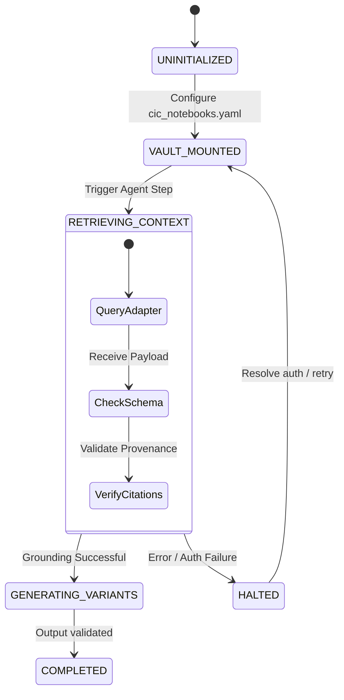

# Rewrite Labs NotebookLM Workflow

**Status:** Proposed / Under Review  
**Date:** 2026-07-08  
**Location:** `docs/rewrite-labs/notebooklm-workflow.md`  

---

## 1. Executive Summary & Concept

In Rewrite Labs, redesigning client websites requires ingestion of client notes, brand books, design requirements, and historical audit documents. Traditional systems rely on flat-file storage or manual pasting, which increases prompt token bloat and drift.

This specification introduces the **Rewrite Labs NotebookLM Workflow**. Under this system, NotebookLM becomes a **Client Knowledge Vault**—a secure, queryable repository of client context that Rewrite Labs agents query on-demand via the [NotebookLM Adapter](../cic/notebooklm-adapter-spec.md). This eliminates prompt bloat, keeps agents aligned with brand guidelines, and enforces deterministic grounding.

---

## 2. Agent Integration Points (RL-4.x Phases)

The Client Knowledge Vault integrates directly with the RL-4.x autonomous agent lifecycle:

```
                  +--------------------------------+
                  |     Client Knowledge Vault     |
                  |     (NotebookLM Notebook)      |
                  +---------------+----------------+
                                  |
            +---------------------+---------------------+
            |                     |                     |
     (Query Context)       (Style Queries)      (Outreach Context)
            |                     |                     |
            v                     v                     v
     [RL-4.6 Crawler]      [RL-4.1 Redesign]     [RL-4.5 Outreach]
      Crawled Audit         Layout & Style        Targeted Email
```

### 2.1 RL-4.6 CrawlerEngine v1 (Audit Grounding)
* **Goal**: Validate that a crawled website aligns with initial client discovery briefs.
* **Mechanism**: After a site crawl, `CrawlerEngine` queries the NotebookLM Vault to match existing site menus, footer text, and page names with client-specified redesign requests.
* **Query Pattern**: `"Does the client specify what pages must exist in the navigation header?"`

### 2.2 RL-4.1 RedesignAgent & DesignVariantRenderer (Style Grounding)
* **Goal**: Generate design code (HTML, CSS variables, Storybook tokens) that respects brand limits.
* **Mechanism**: Prior to rendering layout variants, `RedesignAgent` fetches color palettes, spacing limits, logo details, and type families from the vault.
* **Query Pattern**: `"What are the primary and secondary branding colors, fonts, and logo asset filenames?"`

### 2.3 RL-4.5 OutreachAgent (Outreach Grounding)
* **Goal**: Write hyper-personalized cold outreach emails or progress updates.
* **Mechanism**: `OutreachAgent` queries client history and past communications stored in the vault to formulate emails grounded in client constraints.
* **Query Pattern**: `"What were the key complaints or compliments mentioned in past meetings?"`

---

## 3. Workflow State Machine

The workflow progresses through four main states, ensuring that agents do not execute redesign operations without verification of a grounded knowledge state:



---

## 4. Operational Playbook

### Step 1: Client Onboarding & Vault Mounting
An operator creates a NotebookLM notebook for the client, uploads relevant assets (brand guides, transcripts, domain logs), and registers it:
1. Append client mappings to `cic_notebooks.yaml`:
   ```yaml
   notebook_mappings:
     client_acme_inc: "nb_acme_12345"
   ```
2. Run a pre-flight health check to ensure the MCP server has read-access:
   ```bash
   python -m notebooklm_mcp health --check --notebook nb_acme_12345
   ```

### Step 2: Context Extraction & Grounding
When `RedesignAgent` starts, it initiates a contextual query:
```typescript
const vaultContext = await torqueQuery.getTaskContext({
  namespaces: ["client_acme_inc"],
  query: "Extract brand guidelines, colors, and layout rules.",
  limit: 5
});
```

### Step 3: Synthesis & Verification Gate
The agent synthesizes code using the retrieved context. Before committing changes:
1. The **Define Done** gate runs a verification script mapping generated tokens (e.g. `CIC_TOKEN_PACK`) against the raw context returned by the vault.
2. If any style variable deviates from the vault (e.g., generating `#ff0000` when the brief strictly demands slate-indigo HSL styling), the **Failure Mode Self-Recognition** rules halt the process.

---

## 5. Security & Isolation Boundaries

1. **Credential Hygiene**: Mapped client notebooks are owned and managed by the operator's Google account session. Rewrite Labs processes have zero programmatic access to Google account management APIs (no credentials modification).
2. **Access Scoping**: The Rewrite Labs adapter configuration is read-only. Notebook mutation tools are omitted from the exposed tool pool to prevent accidental deletion of client knowledge files.
3. **Data Residency**: Cached results are stored in localized namespaces within TorqueQuery's PostgreSQL database with a strict 30-day TTL to prevent long-term data leakage.

---

## See Also

* [NotebookLM Adapter Spec](../cic/notebooklm-adapter-spec.md) — Underpinning transport adapter.
* [TorqueQuery NotebookLM Spec](../cic/torquequery-notebooklm-spec.md) — Retrieval and fusion mechanics.
* [Six Rules Framework](../cic/six-rules-framework.md) — Autonomy compliance models.
