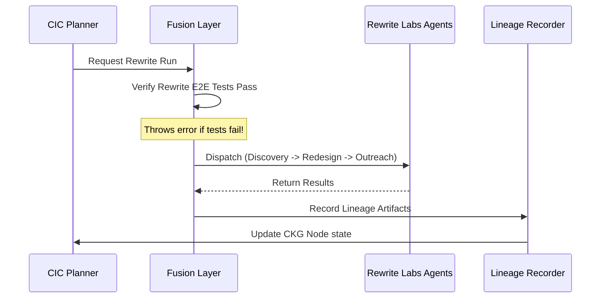

# Rewrite Labs ↔ CIC Fusion Layer Specification (Phase 29)

## Overview
The **Rewrite Labs ↔ CIC Fusion Layer** unites the redesign capabilities of Rewrite Labs with the autonomous operations of Cast Iron Charlie. It allows CIC to trigger discovery, redesign, and outreach loops on behalf of a tenant, while feeding the resulting optimization logs, speed improvements, and outreach conversions back into CIC's Knowledge Graph (CKG) for continuous learning.

---

## Handoff and Feedback Contracts

### 1. CIC → Rewrite Labs Handoff
When CIC decides to run a Rewrite Labs package, it passes a structured request outlining:
- **Tenant Context**: Identifier, current website metadata, design preferences.
- **Goal Parameters**: What needs improvement (e.g. accessibility score, conversion rate, core web vitals).
- **Discovery Context**: Prior crawl snapshots and structural constraints.

### 2. Rewrite Labs → CIC Feedback
Upon run completion, Rewrite Labs returns a detailed performance log:
- **Redesign Metrics**: Code improvements, Lighthouse audit deltas, visual change index.
- **Outreach Logs**: Copy variant scores, email open rates, scheduled conversions.
- **Lineage Metadata**: Links between the original site layout, generated code proposals, and output outreach templates.

---

## Architecture Flow



---

## Dependency & Test Safeguards
To ensure that the fusion layer does not execute with corrupt redesign logic:
- **Pre-execution Verification**: Before every dispatch, the Fusion layer queries the Rewrite Labs test registry. If the E2E suites (`test:rewrite-labs`) have failed, the run is blocked.
- **Isolation Logging**: Every cross-system call is written to a transaction log to prevent network orphan state.

---

## Artifact Schema Contracts

### `rewrite_run.json` (Handoff package)
```json
{
  "runId": "string",
  "tenantId": "string",
  "url": "string",
  "goals": {
    "vitals": ["LCP", "FID"],
    "targetScore": 90
  },
  "timestamp": 0
}
```

### `rewrite_lineage.json` (Feedback/Lineage package)
```json
{
  "lineageId": "string",
  "runId": "string",
  "tenantId": "string",
  "discovery": {
    "crawledUrls": ["string"],
    "framework": "string"
  },
  "redesign": {
    "templateId": "string",
    "changedFiles": ["string"],
    "metrics": {
      "accessibilityDelta": 0.0,
      "seoDelta": 0.0
    }
  },
  "outreach": {
    "copyVariants": ["string"],
    "deliveredCount": 0
  },
  "timestamp": 0
}
```
