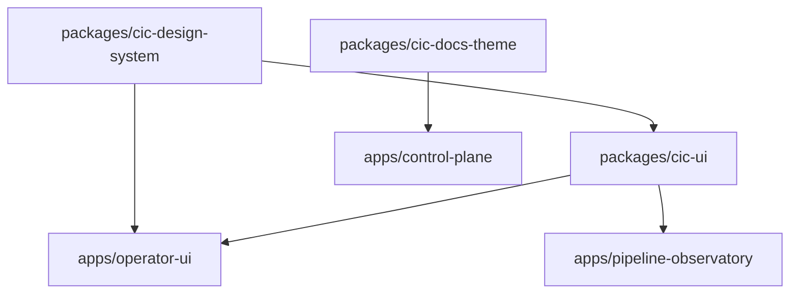

# CIC UI Build Pipeline Blueprint
**Version:** 1.0.0 | **Date:** 2026-05-31 | **Status:** Approved

This blueprint details the build architecture, dependency order, caching strategies, and GitHub Actions workflow for the unified CIC UI monorepo layer.

---

## 🏛️ Build Architecture & Dependency Graph

To ensure clean, deterministic builds, packages must be built in a strict dependency sequence:



### Staged Build Execution Order:
1. **Stage 1 (Core Tokens):** Build `packages/cic-design-system` (generates HSL CSS variables, spacing classes, and responsive tokens).
2. **Stage 2 (Shared Logic):** Build `packages/cic-ui` (compiles reusable JS web component wrappers and dashboard states).
3. **Stage 3 (Site Overrides):** Package `packages/cic-docs-theme` base layouts and css assets.
4. **Stage 4 (App Compilation):** Compile `apps/operator-ui`, `apps/pipeline-observatory`, and `apps/control-plane`.

---

## 🚀 GitHub Actions Workflow Definition

Create this file at `.github/workflows/cic-ui-pipeline.yml` to automate CI checks:

```yaml
# .github/workflows/cic-ui-pipeline.yml
name: CIC UI Build Pipeline & Gating
on:
  push:
    branches: [ main, feat/runtime-install-v1 ]
    paths:
      - 'apps/**'
      - 'packages/**'
      - 'tools/cic-ui/**'
  pull_request:
    branches: [ main ]

jobs:
  validate-and-build:
    name: Validate, Smoke Test, and Build Monorepo
    runs-on: ubuntu-latest

    steps:
      - name: Checkout repository
        uses: actions/checkout@v4

      - name: Setup Node.js
        uses: actions/setup-node@v4
        with:
          node-version: 20
          cache: 'npm'

      - name: Install Monorepo Dependencies
        run: npm install

      - name: Run Integrity Validator
        run: npm run cic-ui:validate

      - name: Execute Automated UI Repair (Dry Run Verification)
        run: bash tools/cic-ui/repair-ui-layer.sh

      - name: Run Build (All Modules)
        run: |
          npm run load-tokens --if-present
          npm run validate-design --if-present

      - name: Execute Smoke Test Suite
        run: npm run cic-ui:smoke

      - name: Staged Package Bundler
        run: |
          tar -czf cic-ui-recovery-pack.tar.gz tools/cic-ui apps/operator-ui/assets

      - name: Upload Build Artifacts
        uses: actions/upload-artifact@v4
        with:
          name: cic-ui-recovery-pack
          path: cic-ui-recovery-pack.tar.gz
          retention-days: 7
```

---

## ⚡ Caching Strategy

To keep CI/CD runs ultra-fast and optimize tokens, follow these caching principles:
- **npm Cache (`~/.npm`):** Configured directly through `actions/setup-node@v4` with `cache: 'npm'`.
- **Workspace Build Cache:** Utilize `pnpm` or local bundler caching configurations where relevant to skip unmodified files during high-frequency staging builds.
